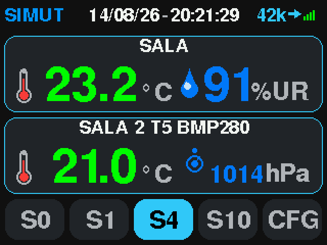

<p align="center">
  
</p>

# SIMUT — Sistema Integrado de Monitoramento Universal e Telemetria

> Sistema Integrado de Monitoreo Universal y Telemetría

> Firmware IoT de nivel profesional para Raspberry Pi Pico W

[English](README.md) | [Português](README.pt-BR.md) | [Español](README.es-ES.md)

[](LICENSE)
[](https://www.raspberrypi.com/products/raspberry-pi-pico/)
[](https://arduino-pico.readthedocs.io/)
[](https://github.com/angeloINTJ/simut/actions/workflows/build.yml)
[](https://github.com/angeloINTJ/simut/releases/latest)
[](https://angelointj.github.io/simut/)
[](#contribuidores-)
[](CONTRIBUTING.es-ES.md)

<p align="center">
  
</p>

## Descripción general

SIMUT es un firmware IoT de nivel profesional para la **Raspberry Pi Pico W** que proporciona monitoreo de temperatura, humedad y presión en tiempo real con arquitectura de doble núcleo. Incluye dashboard local en TFT táctil, interfaz web embebida con control de acceso por roles, histórico binario en el dispositivo con gráficos decimados en el navegador, telemetría (HTTP/MQTT, con MQTT Discovery de Home Assistant), ruta `/metrics` para Prometheus, reenvío remoto de syslog (RFC 5424), actualización OTA y CLI por serial USB.

## ¿Por qué SIMUT?

| Necesidad | Sketch Arduino DIY | ESPHome / Tasmota | **SIMUT** |
|------|:---:|:---:|:---:|
| Autónomo con pantalla | ⚠️ Programación manual | ❌ Sin soporte TFT | ✅ UI táctil integrada |
| Entornos regulados | ❌ Sin traza de auditoría | ❌ Sin RBAC de usuarios | ✅ Multiusuario, logs de auditoría |
| Cadena de frío (−55 °C y sondas bajo cero) | ⚠️ Lecturas básicas | ✅ Monitoreo básico | ✅ Multisensor calibrado |
| Operación offline | ✅ Sí | ❌ A menudo depende de la nube | ✅ Web local completa + pantalla |
| Actualización OTA | ❌ Reflasheo manual | ✅ OTA | ✅ OTA + backup/restore |
| Seguridad | ❌ Ninguna | ⚠️ Básica | ✅ HMAC-SHA256, RBAC, rate limiting, HTTPS opcional |
| Home Assistant | ⚠️ Integración manual | ✅ Nativa | ✅ MQTT Discovery (opcional) |
| Métricas Prometheus | ❌ Ninguna | ✅ Integrado | ✅ Ruta `/metrics` |
| Registro de auditoría remoto | ❌ Ninguno | ⚠️ Complemento | ✅ Syslog (RFC 5424 / UDP) |

**SIMUT es para ti si:** necesitas un sistema de monitoreo de temperatura autónomo, seguro y auditable que funcione con o sin internet — típico de laboratorios, farmacias, bancos de sangre, almacenamiento de vacunas y cadenas de frío alimentarias.

**ESPHome/Tasmota pueden ser mejores si:** no necesitas pantalla local y prefieres configuración YAML a una interfaz web integrada. (Si lo que te retenía allí era Home Assistant: SIMUT ahora habla MQTT Discovery.)

## Arquitectura

```
┌──────────────────────────────────────────────────────────┐
│                    Raspberry Pi Pico W                   │
│  ┌──────────────────────┐  ┌────────────────────────────┐│
│  │      Core 0          │  │        Core 1              ││
│  │  (Bucle principal)   │  │  (Bucle de pantalla)       ││
│  │                      │  │                            ││
│  │  ◆ AppManager ───────┼──┼─ estado/snapshots ─────┐   ││
│  │  ◆ SensorManager     │  │  ◆ DisplayManager ◄────┘   ││
│  │  ◆ WebManager        │  │  ◆ TouchPriority           ││
│  │  ◆ TelemetryManager  │  │  ◆ Renderizador DMA        ││
│  │  ◆ CommandManager    │  │  ◆ Temas                   ││
│  │  ◆ StorageManager    │  │  ◆ i18n (packs EN/PT/ES)   ││
│  │  ◆ NetworkManager    │  │                            ││
│  └──────────┬───────────┘  └────────────────────────────┘│
│             │                                            │
│  ┌──────────┴──────────────────────────────────────────┐ │
│  │  Interfaces de hardware                             │ │
│  │  ◆ SPI → TFT ILI9341 320×240 + Táctil XPT2046       │ │
│  │  ◆ GP0–GP15 → 16 slots universales de sensor:       │ │
│  │      DS18B20 (1-Wire) · DHT22 · BMP280/BME280 (I2C) │ │
│  │  ◆ USB CDC → CLI Serial                             │ │
│  │  ◆ WiFi (CYW43439) → Servidor HTTP + Telemetría     │ │
│  └─────────────────────────────────────────────────────┘ │
└──────────────────────────────────────────────────────────┘
         │                   │                   │
    ┌────┴────┐          ┌───┴────┐         ┌────┴───────┐
    │Sensores │          │ Web UI │         │ Telemetría │
    │ DS18B20 │          │Navegador│        │ HTTP/MQTT  │
    │  DHT22  │          │ (RBAC) │         │  Servidor  │
    │ BMx280  │          └────────┘         └────────────┘
    └─────────┘
```

## Capturas de pantalla

| Dashboard TFT | Gráfico de histórico en TFT | Dashboard web | Alpha inicial |
|:---:|:---:|:---:|:---:|
|  |  |  | [](https://youtu.be/wLjghqId8nE) |

> 📸 Todas las pantallas del display, capturadas del framebuffer del panel real: [docs/images/screens/screens.md](docs/images/screens/screens.md).
>
> 🎥 El video del **alpha inicial** muestra el primer prototipo TFT + táctil — la interfaz fue rediseñada desde entonces.

## Hardware

| Componente | Especificación |
|-----------|---------------|
| MCU | Raspberry Pi Pico W (RP2040, doble núcleo) |
| Pantalla | TFT ILI9341 320×240 (SPI, con DMA) |
| Táctil | Pantalla táctil resistiva XPT2046 |
| Sensores | **16 slots universales en GP0–GP15** — cualquier mezcla de DS18B20 (1-Wire), DHT22, BMP280/BME280 (I2C, 2 pines) |
| Zumbador | Piezo pasivo (por PIO) |
| Almacenamiento | Flash interna de 2 MB (slot de firmware de 1 MB + LittleFS de 1 MB) |

Consulta la **[Guía de Cableado](docs/WIRING.md)** para el pinout completo y los diagramas de conexión.

## Características principales

### Sensores
- **16 slots universales** — GP0–GP15; cada slot acepta DS18B20, DHT22 o BMP280/BME280; tipo y pines asignados en tiempo de ejecución, sin recompilar
- **Temperatura, humedad y presión** como magnitudes de primera clase, offsets de calibración por sensor y curvas de calibración multipunto
- **Pipeline de sensores de confianza cero** — verificación de ROM, detección de cambio de hardware, histéresis de error
- **Alarmas por sensor** — umbrales con melodías en el zumbador y señalización visual en el TFT

### Pantalla y UI
- **TFT ILI9341 320×240** — dashboard, gráficos de histórico por cubetas con banda mín/máx, estadísticas, calendario, ajustes táctiles
- **Ruta rápida de renderizado con DMA** — composición en canvas a velocidad de bus, cero tearing
- **Teclado de contraseña para la yema del dedo** — 8 teclas de grupo + popup; cualquiera de los 91 caracteres en exactamente dos toques
- **Área segura de 4 px en toda la UI** — el offset de alineación de pantalla (±4 px por eje) nunca recorta contenido
- **Temas personalizados** cargados desde LittleFS (hasta 8, editor offline en `tools/theme-editor/`); packs de temas disponibles en compilación
- **Sistema de sonidos** — clases Toque / Confirmación / Error / Alarma / Atención con melodías y volumen configurables

### Conectividad y Web
- **Servidor web embebido** — sesiones multiusuario, RBAC (10 bits de permiso), gestor de archivos, dashboard en vivo con panel de captura de pantalla
- **WebUI comprimida en gzip** — páginas minificadas inline, cacheables en el navegador, temas claro y oscuro
- **Gráficos de histórico decimados en el navegador** — la página descarga los archivos binarios diarios crudos y hace el bucketing mín/máx en el cliente; el dispositivo solo sirve bytes
- **Exportación CSV en el navegador** — decodificada de los mismos archivos crudos por la propia página
- **Telemetría** — HTTP POST y MQTT con payloads JSON / CSV / plantilla personalizada, soporte TLS, lotes adaptativos

### Tiempo y almacenamiento
- **Sincronización NTP** — backoff exponencial, fallback multiservidor, RTC virtual sembrado del histórico entre reinicios
- **Histórico binario compacto (V5)** — codificación delta + ancla a ~5,4 bytes/registro ≈ 116 días de registros en flash (11 canales con cadencia de 1 min)
- **LittleFS** — configuración de doble banco con CRC32, archivos de histórico por día, log compacto rotativo

### Seguridad
- **Autenticación endurecida** — HMAC-SHA256 con salt aleatorio por usuario, 5000 rondas
- **Contraseña de admin aleatoria en el reset de fábrica** — 8 caracteres mostrados una sola vez en el TFT, nunca persistidos
- **Rate limiter** — LRU de 16 slots con TTL de 15 min, evicción consciente de lockout, backoff exponencial
- **Subidas protegidas contra path traversal** — `..`, percent-encoding, bytes de control y caracteres reservados bloqueados
- **[SECURITY.md](SECURITY.md)** con modelo de amenazas, política de rotación y respuesta a incidentes

### Resiliencia y forense
- **Forense de crash** — caja negra con autopsia de los scratch registers del watchdog en cada arranque
- **Disciplina de flash de doble núcleo** — Core 1 comprobadamente pausado en cada escritura de flash (medido, no supuesto)
- **Disciplina de watchdog** — alimentado alrededor de cada operación de LittleFS; clientes HTTP lentos no bloquean el bucle

### Actualización OTA
- **Actualización de firmware OTA** — subida por la web, aplicada in-place con preservación de snapshot de la config (Wi-Fi, usuarios y slots de sensores sobreviven)
- **Backup y restore** — backup/restore completo de LittleFS con verificación de integridad CRC32
- **[Guía de recuperación](docs/RECOVERY.md)** — rutas BOOTSEL y picotool para cada modo de fallo

### Internacionalización
- **3 idiomas de interfaz** — inglés integrado; portugués y español mediante packs `.lng` externos cargados desde LittleFS al arrancar

## Inicio rápido

### Requisitos previos
- [PlatformIO](https://platformio.org/) (Core 6.x o superior)
- Raspberry Pi Pico W
- ¿Sin toolchain local? `docker compose run build` compila en un contenedor — la vía que [CONTRIBUTING.es-ES.md](CONTRIBUTING.es-ES.md) recomienda para nuevos contribuyentes

### Compilar y flashear

```bash
# Clonar el repositorio
git clone https://github.com/angeloINTJ/simut.git
cd simut

# Compilar el firmware
pio run -e pico_w_release

# Flashear la Pico W (auto-reset por toque de 1200 bps; BOOTSEL también funciona)
pio run -e pico_w_release -t upload

# SOLO en el primer flasheo: subir los datos de LittleFS (packs de idioma, favicon).
# ⚠️ uploadfs REFORMATEA la partición LittleFS — en un dispositivo ya en
# servicio destruye histórico, configuración y calibración. No lo repitas
# cuando el dispositivo tenga datos; los packs de idioma pueden subirse
# después desde el gestor de archivos web.
pio run -e pico_w_release -t uploadfs
```

¿Prefieres no compilar? Cada [release](https://github.com/angeloINTJ/simut/releases/latest) incluye un `simut_vX.Y.Z.uf2` listo (arrastrar y soltar con BOOTSEL presionado), además de bundles de código fuente para PlatformIO y Arduino IDE.

### Primer arranque
1. El dispositivo arranca en el dashboard y, en una unidad recién salida de fábrica, muestra una **contraseña de admin aleatoria de 8 caracteres en el TFT** — anótala, no vuelve a aparecer.
2. Configura el Wi-Fi desde los ajustes de la pantalla táctil, **o** mantén un dedo en la pantalla ~3 s durante el arranque para entrar en modo AP de configuración — el dispositivo anuncia la red **`simut_SETUP`** durante 15 minutos.
3. Abre la interfaz web en `http://simut.local` (mDNS) o en la IP mostrada en la pantalla, y entra como `admin` con la contraseña del paso 1. Se te pedirá cambiarla.
4. Añade sensores en **Config → Sensors & GPIO** (o deja que aparezcan con *Scan for probes*).

## Estructura del proyecto

```
simut/
├── src/                    # Todo el código del firmware
│   ├── main.cpp            # Punto de entrada
│   ├── AppManager*         # Máquina de estados de la aplicación
│   ├── DisplayManager*     # Pantalla TFT, táctil, temas (Core 1)
│   ├── WebManager*         # Servidor web, API, endpoints OTA
│   ├── StorageManager*     # LittleFS, configuración, histórico
│   ├── SensorManager*      # Drivers DS18B20 / DHT22 / BMx280
│   ├── NetworkManager*     # WiFi, mDNS, modo AP de configuración
│   ├── TelemetryManager*   # Telemetría MQTT y HTTP
│   ├── CommandManager*     # Parser de la CLI
│   ├── LogManager*         # Logs y forense de crash
│   ├── history/            # Códec V5 de histórico
│   └── SystemDefs*.h       # Constantes y límites del sistema
├── data/                   # Assets de LittleFS (packs de idioma, favicon)
├── test/                   # Tests unitarios nativos (Unity)
├── tools/                  # screen_mapper, scripts de release, editor de temas…
├── docs/                   # Documentación + sitio GitHub Pages
├── WebUI.h                 # Fuente de la web UI (se convierte en WebUI_GZ.h al compilar)
└── platformio.ini          # Configuración de build
```

## Compilación

### Entornos

| Entorno | Propósito |
|-------------|---------|
| `pico_w_release` | Firmware de producción — **la imagen publicada en los releases** |
| `pico_w_test` | Mismo firmware + CLI completa de 56 comandos para las suites de banco |
| `pico_w_asserts` | Release + aserciones de concurrencia |
| `pico_w_alpha` | Build headless (LCD 16×2, sin TFT) |
| `native`, `native_history_v4/v5`, `native_cli` | Tests unitarios en el host |
| `native_logpolicy` | Filtro de persistencia de logs edge-triggered (18 tests) |

> `pico_w_debug` existe pero no enlaza — en `-Og` la imagen desborda el slot de 1020 KB. La flash va justa: la imagen release usa ~97 % del slot.

### Flags de compilación
- `-Os` — optimización por tamaño
- `-Wall -Wextra` — warnings elevados
- `-specs=nano.specs` — newlib-nano para un binario más pequeño
- LTO deshabilitado (limitación del toolchain con Arduino-Pico de earlephilhower)

## Configuración

### CLI
Hay una interfaz de línea de comandos disponible por serial USB (115200 baudios).

- La **imagen release** incluye una consola de emergencia mínima de 10 comandos: `show net status`, `show system info`, `show system log`, `debug on|off`, `system admin reset`, `system format`, `system factory`, `system https off`, `reload`, `help`.
- La **imagen `pico_w_test`** incluye la CLI completa estilo Cisco (56 comandos, modos `enable` / `configure terminal`) — ver el [Manual de la CLI](docs/CLI-Manual.md) (en portugués).

La configuración del día a día está pensada para hacerse en la pantalla táctil y en la interfaz web, que siempre son completas.

### API Web
El dispositivo expone una API REST en `http://<ip-del-dispositivo>/api/`. La tabla completa de rutas está en el [Manual de Usuario](docs/MANUAL.md).

## Pruebas

```bash
# Tests unitarios en el host
pio test -e native            # validadores, CRC, conversión float, lógica de tiempo
pio test -e native_history_v5 # códec V5 de histórico (54 tests)
pio test -e native_cli        # parser de la CLI

# Comprobaciones de referencia del códec V5 (Python vs C++, 20 mil casos aleatorios)
python3 tools/check_history_v5_parity.py --cases 20000
python3 tools/history_v5.py --selftest --trials 200000
```

## Documentación

| Documento | Descripción |
|----------|-------------|
| [Manual de Usuario (EN)](docs/MANUAL.md) | Montaje, pantalla/web/CLI, OTA, referencia de la API, resolución de problemas |
| [Manual do Usuário (pt-BR)](docs/MANUAL.pt-BR.html) | Manual completo en portugués, con pantallas reales |
| [Guía de Cableado](docs/WIRING.md) | Pinout completo y diagramas de conexión |
| [Guía de Recuperación](docs/RECOVERY.md) | Recuperación de brick — BOOTSEL, picotool, reset 1200 bps |
| [Manual de la CLI](docs/CLI-Manual.md) | Referencia completa de la consola `pico_w_test` (en portugués) |
| [Política de Seguridad](SECURITY.md) | Modelo de amenazas, manejo de credenciales, respuesta a incidentes |
| [Changelog](CHANGELOG.md) | Historial de versiones y cambios |

## Contribuir

¡Las contribuciones son bienvenidas! Lee [CONTRIBUTING.es-ES.md](CONTRIBUTING.es-ES.md) para el setup de desarrollo, las convenciones de código y el proceso de pull request.

Todos los contribuidores deben seguir el [Código de Conducta](CODE_OF_CONDUCT.es-ES.md).

## Soporte

- **Reportes de bugs:** [GitHub Issues](https://github.com/angeloINTJ/simut/issues/new?template=bug_report.md)
- **Solicitudes de funciones:** [GitHub Issues](https://github.com/angeloINTJ/simut/issues/new?template=feature_request.md)
- **Vulnerabilidades de seguridad:** ver [SECURITY.md](SECURITY.md) — no abras una issue pública
- **Preguntas:** abre una discusión o una issue

## Contribuidores ✨

Gracias a estas personas maravillosas:

<!-- ALL-CONTRIBUTORS-LIST:START - Do not remove or modify this section -->
<!-- prettier-ignore-start -->
<!-- markdownlint-disable -->
<table>
  <tbody>
    <tr>
      <td align="center" valign="top" width="14.28%"><a href="https://github.com/angeloINTJ"><br /><sub><b>Ângelo Moisés Alves</b></sub></a><br /><a href="https://github.com/angeloINTJ/simut/commits?author=angeloINTJ" title="Code">💻</a> <a href="https://github.com/angeloINTJ/simut/commits?author=angeloINTJ" title="Documentation">📖</a> <a href="#design-angeloINTJ" title="Design">🎨</a> <a href="#hardware-angeloINTJ" title="Hardware">🔌</a> <a href="#security-angeloINTJ" title="Security">🛡️</a> <a href="#maintenance-angeloINTJ" title="Maintenance">🚧</a></td>
      <td align="center" valign="top" width="14.28%"><a href="https://github.com/LorenzoLongaretto"><br /><sub><b>Lorenzo Longaretto</b></sub></a><br /><a href="https://github.com/angeloINTJ/simut/commits?author=LorenzoLongaretto" title="Tests">🧪</a> <a href="https://github.com/angeloINTJ/simut/commits?author=LorenzoLongaretto" title="Code">💻</a></td>
      <td align="center" valign="top" width="14.28%"><a href="https://github.com/JohnMartin0301"><br /><sub><b>John Martin</b></sub></a><br /><a href="#infra-JohnMartin0301" title="Infrastructure">🚇</a> <a href="https://github.com/angeloINTJ/simut/commits?author=JohnMartin0301" title="Code">💻</a></td>
      <td align="center" valign="top" width="14.28%"><a href="https://github.com/f-p-0"><br /><sub><b>f p</b></sub></a><br /><a href="https://github.com/angeloINTJ/simut/commits?author=f-p-0" title="Documentation">📖</a></td>
      <td align="center" valign="top" width="14.28%"><a href="https://github.com/drmikecrypto"><br /><sub><b>Mike</b></sub></a><br /><a href="https://github.com/angeloINTJ/simut/commits?author=drmikecrypto" title="Code">💻</a> <a href="https://github.com/angeloINTJ/simut/commits?author=drmikecrypto" title="Tests">🧪</a> <a href="https://github.com/angeloINTJ/simut/commits?author=drmikecrypto" title="Documentation">📖</a></td>
    </tr>
  </tbody>
</table>
<!-- markdownlint-restore -->
<!-- prettier-ignore-end -->
<!-- ALL-CONTRIBUTORS-LIST:END -->

Este proyecto sigue la especificación [all-contributors](https://allcontributors.org).

## Powered by SIMUT

¿Tu producto o proyecto usa SIMUT? Añade esta insignia a tu README, documentación o página de producto:

```markdown
[](https://github.com/angeloINTJ/simut)
```

[](https://github.com/angeloINTJ/simut)

**Versión grande** (para presentaciones, pósteres o embalaje de producto):

```markdown
[](https://github.com/angeloINTJ/simut)
```

[](https://github.com/angeloINTJ/simut)

---

## Licencia

Licencia MIT — ver [LICENSE](LICENSE) para los detalles.

Copyright © 2026 Ângelo Moisés Alves
