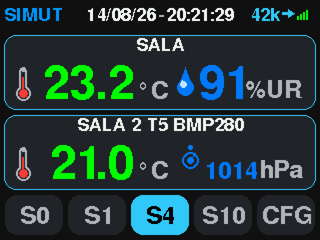
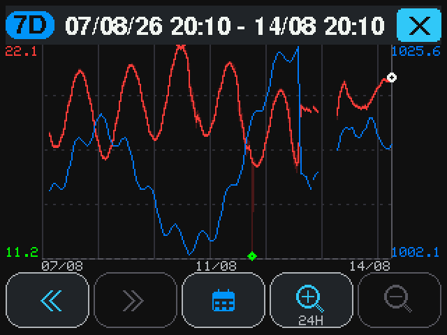
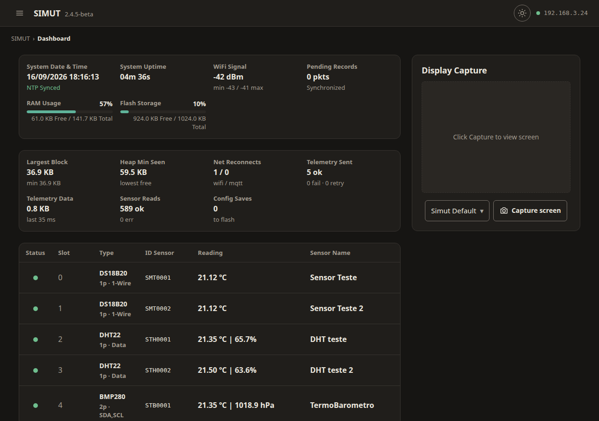

<p align="center">
  <picture>
    <source media="(prefers-color-scheme: dark)" srcset="docs/images/logo-wordmark-dark.svg">
    <source media="(prefers-color-scheme: light)" srcset="docs/images/logo-wordmark.svg">
    
  </picture>
</p>

# SIMUT — Sistema Integrado de Monitoramento Universal e Telemetria

> Integrated Universal Monitoring and Telemetry System

> Offline-first temperature, humidity and pressure monitoring for the Raspberry Pi Pico W

[English](README.md) | [Português](README.pt-BR.md) | [Español](README.es-ES.md)

[](LICENSE)
[](https://www.raspberrypi.com/products/raspberry-pi-pico/)
[](https://arduino-pico.readthedocs.io/)
[](https://github.com/angeloINTJ/simut/actions/workflows/build.yml)
[](https://github.com/angeloINTJ/simut/releases/latest)
[](https://angelointj.github.io/simut/)
[](#contributors)
[](CONTRIBUTING.md)

<p align="center">
  
</p>

## Overview

SIMUT is IoT firmware for the **Raspberry Pi Pico W** that monitors temperature, humidity and pressure on up to 16 sensors, and keeps working with or without a network. One source tree builds three published devices:

- a **touch-panel monitor** (320×240 TFT);
- a **character-LCD monitor** (16×2, the *alpha*);
- a **battery logger** that hibernates between readings (the *Air*, experimental).

They share one core:
- binary on-device history and per-channel alarms;
- 32 user accounts with 13 permission bits;
- an embedded web interface;
- telemetry over HTTP(S) or MQTT(S), with a separate line for alarms;
- Home Assistant MQTT Discovery, a Prometheus `/metrics` endpoint and remote syslog (RFC 5424);
- over-the-air updates and a serial console.

## Project status

| | |
|---|---|
| **Current release** | **v2.10.0** (2026-10-03); the [changelog](CHANGELOG.md) says what each version changed. SIMUT left beta with v2.7.0, on measurements: an 8.18 h soak with 0 reboots, and 6 of 6 over-the-air updates with nothing lost. |
| **Published images** | Three images, each as `.uf2` and `.bin`: `release` (TFT touch panel), `alpha` (16×2 LCD with a Bluetooth console) and `air` (headless battery logger). The pt-BR and es-ES language packs and an OTA manifest ship alongside. An image with a different set of features comes from the [build configurator](https://angelointj.github.io/simut/configurador/), and CI builds it from `main`. |
| **Maturity** | <ul><li>`release`: **stable**.</li><li>`alpha`: published and bench-tested, its 16×2 LCD included since 2026-09-26.</li><li>`air`: **experimental**. Its one long soak failed: a sleep in cycle 119 never woke (F28). A watchdog across the wake now mitigates it; the root cause is not confirmed.</li></ul> |
| **Tests** | Every pull request runs 609 host test cases in 9 suites, 60 s of fuzzing and static analysis, and builds all seven firmware images from a cold cache. Behaviour on real hardware is verified on a bench — see [Verification on hardware](docs/VERIFICATION.md). |

**Known limitations.** Each one is documented where it applies.
- **Updates.** An update over the air reformats the filesystem:
  - Wi-Fi, accounts and sensor slots are carried across. History, calibration files and language packs are not, so the web page downloads a backup before it starts, and restoring it brings them back.
  - There is one firmware slot and no rollback. A bad flash is recovered with BOOTSEL and a USB cable.
  - Since v2.9.0, only an image the project signed installs over the air: a release `.bin`, or a build from the configurator. A build of your own goes over USB.
- **Unexplained resets.** A watchdog reset (`ctx=209` or `ctx=455`) appeared three times on the test image on 20–21 September and not since; the one caught with its context had Core 0 in the console (`ctx=209`). Both cores are now instrumented to explain the next one. A `ctx=455` (empty trace) on the first boot after `picotool load -x` is not this: that reboot goes through the watchdog, and the record appeared after 11 of 11 such flashes and after none of 7 hardware resets (2026-09-30).
- **Idle connections.** During the v2.7.0 soak, 7.1 % of responses on an idle keep-alive connection arrived cut short. The device drops a stream it cannot send for 4 s.
- **Chunked replies.** Read in a tight loop, 0.15–0.6 % of `/api/status` replies arrive with their chunked framing broken ([#189](https://github.com/angeloINTJ/simut/issues/189)). The device does not restart and the next request works; the page misses one update.
- **Not a certified instrument.** SIMUT is not a certified metrological instrument. Validate it against your own reference before relying on it for regulated storage.

## Why SIMUT?

| Need | DIY Arduino sketch | ESPHome / Tasmota | **SIMUT** |
|------|:---:|:---:|:---:|
| Standalone with display | Manual coding | No TFT support | Built-in touch UI, or a 16×2 LCD |
| Regulated environments | No audit trail | No user RBAC | 32 accounts, per-account panel PIN, a persistent event log and remote syslog |
| Cold chain (probes down to −50 °C) | Basic readings | Basic monitoring | Calibrated multi-sensor, maintenance windows |
| Offline operation | Yes | Often cloud-dependent | Full local web + display |
| OTA updates | Manual reflash | OTA | Signed OTA + backup/restore |
| Security | None | Basic | HMAC-SHA256, 13-bit RBAC, lockouts, optional HTTPS |
| Home Assistant | Manual setup | Native | MQTT Discovery (opt-in) |
| Prometheus metrics | None | Built-in | `/metrics` endpoint |
| Remote audit log | None | Add-on | Syslog (RFC 5424 / UDP) |

**SIMUT is for you if:** you need a standalone, secure, auditable temperature monitoring system that works with or without internet — typical in laboratories, pharmacies, blood banks, vaccine storage, and food cold chains.

**ESPHome/Tasmota may be better if:** you don't need a local display and prefer YAML configuration over a built-in web UI. (If what kept you there was Home Assistant: SIMUT speaks MQTT Discovery.)

## Architecture

```
┌──────────────────────────────────────────────────────────┐
│                    Raspberry Pi Pico W                   │
│  ┌──────────────────────┐  ┌────────────────────────────┐│
│  │      Core 0          │  │        Core 1              ││
│  │  (Main Loop)         │  │  (Display Loop)            ││
│  │                      │  │                            ││
│  │  ◆ AppManager ───────┼──┼─ state/snapshots ──────┐   ││
│  │  ◆ SensorManager     │  │  ◆ DisplayManager ◄────┘   ││
│  │  ◆ WebManager        │  │  ◆ TouchPriority           ││
│  │  ◆ TelemetryManager  │  │  ◆ DMA canvas renderer     ││
│  │  ◆ CommandManager    │  │  ◆ Themes                  ││
│  │  ◆ StorageManager    │  │  ◆ i18n (EN/PT/ES packs)   ││
│  │  ◆ NetworkManager    │  │                            ││
│  └──────────┬───────────┘  └────────────────────────────┘│
│             │                                            │
│  ┌──────────┴──────────────────────────────────────────┐ │
│  │  Hardware Interfaces                                │ │
│  │  ◆ SPI → ILI9341 TFT 320×240 + XPT2046 Touch        │ │
│  │    (alpha: HD44780 16×2 LCD · Air: no display)      │ │
│  │  ◆ GP0–GP15 → 16 universal sensor slots:            │ │
│  │      DS18B20 (1-Wire) · DHT22 · BMP280/BME280 (I2C) │ │
│  │  ◆ USB CDC → serial console (+ Bluetooth: alpha/Air)│ │
│  │  ◆ WiFi (CYW43439) → HTTP(S) server + telemetry     │ │
│  └─────────────────────────────────────────────────────┘ │
└──────────────────────────────────────────────────────────┘
         │                   │                   │
    ┌────┴────┐          ┌───┴────┐         ┌────┴───────┐
    │ Sensors │          │ Web UI │         │  Telemetry │
    │ DS18B20 │          │ Browser│         │ HTTP(S) /  │
    │  DHT22  │          │ (RBAC) │         │  MQTT(S)   │
    │ BMx280  │          └────────┘         └────────────┘
    └─────────┘
```

## Screenshots

| TFT dashboard | TFT history graph | Web dashboard | Early alpha |
|:---:|:---:|:---:|:---:|
|  |  |  | [](https://youtu.be/wLjghqId8nE) |

> Every display screen, captured off the real panel framebuffer: [docs/images/screens/screens.md](docs/images/screens/screens.md).
>
> The **early alpha** video shows the first TFT + touch prototype — the UI has been redesigned since.

## Hardware

| Component | Specification |
|-----------|---------------|
| MCU | Raspberry Pi Pico W (RP2040, dual-core) |
| Display | `release`: ILI9341 320×240 TFT (SPI, DMA-driven) · `alpha`: HD44780 16×2 character LCD (4-bit) · `air`: none |
| Touch | XPT2046 resistive touchscreen (`release`) |
| Sensors | **16 universal slots on GP0–GP15** — any mix of DS18B20 (1-Wire), DHT22 and BMP280/BME280. A BMx280 is I²C and takes two pins; two of them can share a pair (0x76/0x77) |
| Buzzer | Passive piezo (PIO-driven) — not on the Air |
| Storage | 2 MB internal flash (1 MB firmware slot + 1 MB LittleFS) |

See the **[wiring guide](docs/WIRING.md)** for the complete pinout and connection diagrams.

> **SIMUT PCB — layout available for download** — the KiCad board design (`.kicad_pcb`, `.kicad_sch`) lives in [`PCB_test/`](PCB_test/), and the ready-to-fab package (Gerbers + PTH/NPTH drills, no paste layers) is published as a public release: **[simut-pcb-v1.1 — `simut_pcb_fabrication.zip`](https://github.com/angeloINTJ/simut/releases/tag/simut-pcb-v1.1)**.

## Features

- **Sensing and alarms** — 16 universal sensor slots (DS18B20, DHT22, BMP280/BME280) assigned at runtime, calibration curves, per-channel limits, a fault alarm and maintenance windows.
- **Touch panel** (`release`) — dashboard, history graphs and calendar, and identity at the glass: an account, then its PIN.
- **Character LCD** (`alpha`) — every slot in turn, the setup access point and a Bluetooth console.
- **Web interface** — 11 pages, a live panel mirror, history graphs and CSV export in the browser.
- **HTTP API** — 62 routes. Each one is either gated by a permission or public by design, and CI checks it.
- **Telemetry** — HTTP, HTTPS, MQTT and MQTTS, batched by quantity, and a second, acknowledged line for alarms; Home Assistant, Prometheus and syslog.
- **Network and time** — Wi-Fi that reconnects itself, a setup access point opened on request, and NTP with a provisional clock until it syncs.
- **Storage** — the V5 binary history (about 116 days in 1 MB), a configuration with CRC32 and a `.bak`, and an event log with 157 event codes.
- **Security** — 32 accounts, 13 permission bits, salted HMAC-SHA256, lockouts and optional HTTPS.
- **Updates** — signed over-the-air updates from the web page, and backup and restore of the whole filesystem.
- **SIMUT Air** (experimental) — a battery logger that hibernates between readings.
- **Languages** — English built in; pt-BR and es-ES as language packs.

Every feature in detail, and which ones a custom build can leave out: **[docs/FEATURES.md](docs/FEATURES.md)**.

## Quick start

### Prerequisites
- [PlatformIO](https://platformio.org/) (Core 6.x or later)
- `pip install zopfli` — optional; the web pages compress 2,888 B smaller with it, and the flash budgets are measured with it
- Raspberry Pi Pico W
- No local toolchain? `docker compose run build` builds in a container — the path [CONTRIBUTING.md](CONTRIBUTING.md) recommends for new contributors

### Build and flash

```bash
# Clone the repository
git clone https://github.com/angeloINTJ/simut.git
cd simut

# Build firmware
pio run -e pico_w_release

# Flash to Pico W (auto-reset via 1200 bps touch; BOOTSEL works too)
pio run -e pico_w_release -t upload

# First flash only: upload LittleFS data (language packs, themes, favicon).
# Warning: uploadfs reformats the LittleFS partition — on a device already in
# service it destroys history, config and calibration. Never run it again
# after the device has data; language packs can be uploaded later from the
# web file manager instead. It copies both language packs, and the device
# loads the first alphabetically (es-ES): delete the one you do not want.
pio run -e pico_w_release -t uploadfs
```

Prefer not to build? Every [release](https://github.com/angeloINTJ/simut/releases/latest) ships `simut_vX.Y.Z_release.uf2`, `_alpha.uf2` and `_air.uf2` (drag-and-drop with BOOTSEL held), the matching `.bin` for over-the-air updates, and the pt-BR and es-ES language packs. An image with a different set of features comes from the [build configurator](https://angelointj.github.io/simut/configurador/).

### First boot
1. **Capture the admin password.** A factory-fresh unit prints a random 8-character admin password **once on the USB serial console** (115200 baud). It is never stored in plain text. If you miss it, `system admin reset confirm` over USB prints a new one.
2. **Join it to your network.** The setup access point opens when you ask for it: type `ap` on the console (on the Air, after `enable`), or use Settings → 8 on the touch panel. From v2.7.1 to v2.8.0, a unit with no network configured opened it by itself; it no longer does.
   - Join `<name>_SETUP` (`simut_SETUP` from the factory). It is WPA2, and its per-device key is in the reply to `ap`, on the USB console and on the TFT's boot terminal.
   - The portal opens at `http://192.168.4.1`.
   - The device keeps measuring while the access point is up; only telemetry and syslog wait for the network. v2.7.1 to v2.8.0 read no sensors, checked no alarms and recorded no history while it was up.

   Without a screen, you can use the console instead: `system ssid <name>`, `system pass <secret>`, then `reload confirm`. The console stops at the first space, so a network name or password with a space has to go through the web page.

   With no network configured, the unit asks for the date and time at the end of the boot, because without a network there is no NTP: the touch panel opens a date-and-time screen (**SKIP** leaves it, and Settings → 4 sets the clock later), and every image prints `No network, provisional clock: conf time YYYY-MM-DD HH:MM:SS` on the console. That command works on every image's console, over USB or Bluetooth: on the alpha and the Air, which have no panel, it is how the question is answered. The web page's **Date & Time** section sets the clock too.
3. **Open the web interface** at the address the device got — on the `release` image also `http://simut.local` — and log in as `admin` with the password from step 1. You will be asked to choose a new one.
4. **Add sensors** in **Config → Sensors & GPIO**, or let *Scan for probes* find them.
5. **On the touch panel**, Settings asks for an account and its PIN. The factory admin PIN is `1234`, and it must be changed on first use.

## Project structure

```
simut/
├── src/                    # Firmware source (C++17)
│   ├── main.cpp            # Entry point
│   ├── AppManager*         # Application state machine, boot, alarms, Air cycle
│   ├── DisplayManager*     # TFT panel and alpha LCD (Core 1), touch, themes
│   ├── WebManager*         # Web server, HTTP API, sessions, OTA, TLS
│   ├── StorageManager*     # LittleFS, config, accounts, history files
│   ├── SensorManager*      # DS18B20 / DHT22 / BMx280 drivers
│   ├── NetworkManager*     # Wi-Fi, reconnect ladder, setup AP, mDNS, NTP
│   ├── TelemetryManager*   # HTTP(S)/MQTT(S) telemetry and the alarm line
│   ├── CommandManager*     # Serial and Bluetooth console
│   ├── LogManager*         # Event log and crash forensics
│   ├── HistoryV5.*         # V5 history codec
│   ├── air/                # SIMUT Air configuration
│   ├── display/            # Keypads, fonts and labels shared by the displays
│   ├── sensors/            # Channel table, calibration curves
│   ├── ota/                # Update staging, validation and applier
│   └── SystemDefs*.h       # System constants and limits
├── data/                   # LittleFS assets (language packs, themes, favicon)
├── PCB_test/               # KiCad PCB design + Gerber/DRL fabrication files
├── test/                   # Native unit tests (Unity), nine suites
├── tools/                  # Build gates, bench suites, PicoHand, release scripts, theme editor
├── docs/                   # Documentation + GitHub Pages site
├── WebUI.h                 # Web UI source (gzipped into src/WebUI_GZ.h at build)
├── AGENTS.md               # Bench manual: flashing, the Air, measuring (Portuguese)
└── platformio.ini          # Build configuration
```

## Building

### Environments

| Environment | Purpose | Published |
|-------------|---------|:---:|
| `pico_w_release` | Production image for the TFT panel: emergency console, HTTPS server, mDNS | `…_release` |
| `pico_w_alpha` | 16×2 character LCD (HD44780), no touch; emergency console + Bluetooth console | `…_alpha` |
| `pico_w_air` | **Experimental** — SIMUT Air: headless, no buzzer, hibernation cycle (M0 awake / M1 wake-read-send-sleep); full console + Bluetooth. See §17 of the [user manual](docs/MANUAL.md) | `…_air` |
| `pico_w_test` | Bench image: the full console for the test suites; no HTTPS, no mDNS | — |
| `pico_w_test_https` | `pico_w_test` plus the HTTPS server, for TLS validation; three of its pages are served from LittleFS to fit | — |
| `pico_w_asserts` | Release + concurrency assertions | — |
| `pico2_w_release` | The release compiled for the Pico 2 W (RP2350), so CI sees it build. It boots on the bench board; it refuses updates over the air until its A/B slots exist | — |
| eight `native*` envs | Host-side unit tests — see [Testing](#testing) | — |

> **Security note for `pico_w_alpha` and `pico_w_air`:** both compile the
> Bluetooth SPP console in (`SIMUT_BLUETOOTH=1`), so on those two images it is
> live attack surface. It is authenticated by the **admin web password**, with
> an exponential lockout that survives a reconnect, and a discovery window that
> closes 5 minutes after boot. Recovery commands are restricted to USB.
>
> The setup access point is WPA2 on every image, with a per-device key shown on
> the console and, where there is one, on the display. See [SECURITY.md](SECURITY.md) §2 and §8.

> There is no debug environment. `pico_w_debug` was removed in v2.4.1 after never once linking: at `-Og` the image overflowed the 1020 KB app slot by ~100 KB. Flash is tight. The release image uses 97.7 % of the 1,044,480 B program slot (`tools/flash_budget.json` keeps the measured value), and CI checks every `.bin`, with its 241 B signature, against the 1,040,384 B over-the-air ceiling. A GDB target would have to be built by cutting features. For the concurrency tripwire on hardware, use `pico_w_asserts`.

### Build flags
- `-Os` — optimize for size
- `-Wall -Wextra`, and `-Werror` on `src/` (third-party libraries are not held to it)
- `-specs=nano.specs` — newlib-nano for smaller binary
- `-DNDEBUG` on every image
- LTO is disabled (toolchain limitation with earlephilhower Arduino-Pico)
- The framework is pinned to arduino-pico 5.6.1 and patched by `tools/arduino_pico_overrides/patch.sh`

## Configuration

### Console (CLI)
A serial console is available over USB (115200 baud), and over Bluetooth SPP on the alpha and the Air.

- **The emergency console** runs on the `release` and `alpha` images. Its 15 commands:
  - `show net status`, `show system info`, `show system log`
  - `debug on|off`
  - `system admin reset`, `system format`, `system factory`, `system https off`
  - `system ssid <name>`, `system pass <secret>`, `system cors <origin|off>`
  - `ap`, `time <date> <time>`, `reload`, `help`

  Destructive commands ask for `confirm`, and the four recoveries (`system factory`, `system format`, `system admin reset`, `system https off`) are refused over Bluetooth.
- **The full Cisco-style console** (`enable` / `configure terminal`) runs on the `air` image and the `pico_w_test` bench images — see the [CLI manual](docs/CLI-Manual.md) (in Portuguese). The Air adds `air status | hibernate | stop | idle <sec> | charger <gpio|off>`.

**Where configuration happens:**
- **The web interface** is the day-to-day tool.
- **The touch panel** covers what an operator needs at the device: themes, alarms, sounds, language, their own PIN, users, the PIN policy, touch calibration, display offset, status, the setup access point and the date and time.

### Web API
The device exposes a REST API at `http://<device-ip>/api/`:
- **62 routes** — 52 gated by a permission, 10 public by design, 0 ungated, checked by `tools/check_authz.py` in CI;
- the route table is in the [user manual](docs/MANUAL.md);
- [docs/AUTHORIZATION.md](docs/AUTHORIZATION.md) maps each route to its permission;
- [docs/API_POST.md](docs/API_POST.md) documents the POST bodies.

## Testing

### Host tests

```bash
pio test -e native             # validators, telemetry cursor, labels, parsers, language packs, the License and update screens, the Settings menu, the password check, the web session (283 cases)
pio test -e native_history_v5  # V5 history codec (62)
pio test -e native_cli         # CLI parser (33)
pio test -e native_logpolicy   # edge-triggered log persistence, autopsy bands, touch wake (57)
pio test -e native_alarmqueue  # alarm telemetry queue (54)
pio test -e native_network     # Wi-Fi reconnect state machine (36)
pio test -e native_air         # SIMUT Air persistent config (16)
pio test -e native_sensors     # sensor type table (13)
pio test -e native_otasig      # OTA image signature check, the backup restore and the RP2350's slot writer (55)

# V5 codec reference checks (Python vs C++, 20k random cases)
python3 tools/check_history_v5_parity.py --cases 20000
python3 tools/history_v5.py --selftest --trials 200000
```

### Continuous integration

Every push and pull request to `main` runs four jobs:
- **gates** — the host suites plus these checks:
  - secret scan, log-code tables, authorization matrix;
  - licence consistency, filesystem guard, Air consistency;
  - history day-merge tests.
- **firmware** — all seven images, built from a cold cache:
  - each is checked against its flash budget and the over-the-air ceiling;
  - the build itself enforces `-Werror` and the web UI, CLI help, log-code, channel-table and language-pack gates.
- **fuzz** — 60 s of libFuzzer against the web-API validators, with contract oracles.
- **static analysis** — cppcheck, at a pinned version.

`main` is protected: nine of these checks must pass before anything merges, every job except the `pico_w_test_https` image.

### Verification on hardware

Behaviour is checked on a bench: a Pico W with the TFT panel and touch, and a second Pico, the *PicoHand*, that works the target's RESET and BOOTSEL lines. Every measurement, dated, with its numbers: **[docs/VERIFICATION.md](docs/VERIFICATION.md)**.

## Documentation

| Document | Description |
|----------|-------------|
| [User manual](docs/MANUAL.md) | Hardware setup, display/web/console guide, OTA, API reference, troubleshooting — kept current |
| [Manual do usuário (pt-BR)](docs/MANUAL.pt-BR.md) | The same manual, in Portuguese |
| [Complete manual (pt-BR)](docs/MANUAL.pt-BR.html) | The full product manual in Portuguese, updated for v2.10.0: 31 chapters on installation, configuration, daily use and server integration. Screenshots are being recaptured; each missing one is marked where it belongs |
| [Wiring guide](docs/WIRING.md) | Complete pinout and connection diagrams |
| [Over-the-air updates](docs/OTA_USAGE.md) | Updating from the web page, and what survives it |
| [Recovery guide](docs/RECOVERY.md) | Brick recovery — BOOTSEL, picotool, 1200 bps reset |
| [CLI manual](docs/CLI-Manual.md) | Full console reference, the Air's included (in Portuguese) |
| [Authorization matrix](docs/AUTHORIZATION.md) | Every HTTP route and the permission it requires |
| [Security policy](SECURITY.md) | Threat model, credential handling, incident response |
| [Features](docs/FEATURES.md) | Every feature in detail |
| [Verification on hardware](docs/VERIFICATION.md) | What has been measured on the bench, dated |
| [Documentation index](docs/README.md) | Which documents are kept current and which are snapshots |
| [Changelog](CHANGELOG.md) | Version history and feature changes |

## How SIMUT is developed

Most changes are written by an AI coding agent (Claude Code) in sessions the maintainer directs: from 1 September to 2 October 2026, 275 of the 371 commits on `main` carried a `Co-Authored-By: Claude` line. The instructions those sessions follow are [CLAUDE.md](CLAUDE.md) and [AGENTS.md](AGENTS.md) (in Portuguese). The rules are the same for every change, whoever typed it:
- it reaches `main` only through a pull request, after nine required checks pass: the nine host test suites, also under AddressSanitizer and UBSan, 60 s of fuzzing, static analysis, and six firmware images built from a cold cache;
- the tests come first: a fix carries a reproduction that fails before it and passes after, and a refactor shows that the behaviour did not change;
- a claim about bytes, speed or a fix carries its measurement, and what was not checked on hardware says so;
- product decisions, and the decision to merge, are the maintainer's.

## Contributing

Contributions are welcome. Read [CONTRIBUTING.md](CONTRIBUTING.md) for the development setup, the code conventions and the pull request process.

All contributors must follow the [Code of Conduct](CODE_OF_CONDUCT.md).

## Support

- **Bug reports:** [GitHub Issues](https://github.com/angeloINTJ/simut/issues/new?template=bug_report.md)
- **Feature requests:** [GitHub Issues](https://github.com/angeloINTJ/simut/issues/new?template=feature_request.md)
- **Security vulnerabilities:** See [SECURITY.md](SECURITY.md) — do not open a public issue
- **Questions:** Open a discussion or issue

## Contributors

Thanks to everyone who has contributed:

<!-- ALL-CONTRIBUTORS-LIST:START - Do not remove or modify this section -->
<!-- prettier-ignore-start -->
<!-- markdownlint-disable -->
<table>
  <tbody>
    <tr>
      <td align="center" valign="top" width="14.28%"><a href="https://github.com/angeloINTJ"><br /><sub><b>Ângelo Moisés Alves</b></sub></a><br /><a href="https://github.com/angeloINTJ/simut/commits?author=angeloINTJ" title="Code">💻</a> <a href="https://github.com/angeloINTJ/simut/commits?author=angeloINTJ" title="Documentation">📖</a> <a href="#design-angeloINTJ" title="Design">🎨</a> <a href="#hardware-angeloINTJ" title="Hardware">🔌</a> <a href="#security-angeloINTJ" title="Security">🛡️</a> <a href="#maintenance-angeloINTJ" title="Maintenance">🚧</a></td>
      <td align="center" valign="top" width="14.28%"><a href="https://github.com/LorenzoLongaretto"><br /><sub><b>Lorenzo Longaretto</b></sub></a><br /><a href="https://github.com/angeloINTJ/simut/commits?author=LorenzoLongaretto" title="Tests">🧪</a> <a href="https://github.com/angeloINTJ/simut/commits?author=LorenzoLongaretto" title="Code">💻</a></td>
      <td align="center" valign="top" width="14.28%"><a href="https://github.com/JohnMartin0301"><br /><sub><b>John Martin</b></sub></a><br /><a href="#infra-JohnMartin0301" title="Infrastructure">🚇</a> <a href="https://github.com/angeloINTJ/simut/commits?author=JohnMartin0301" title="Code">💻</a></td>
      <td align="center" valign="top" width="14.28%"><a href="https://github.com/f-p-0"><br /><sub><b>f p</b></sub></a><br /><a href="https://github.com/angeloINTJ/simut/commits?author=f-p-0" title="Documentation">📖</a></td>
      <td align="center" valign="top" width="14.28%"><a href="https://github.com/drmikecrypto"><br /><sub><b>Mike</b></sub></a><br /><a href="https://github.com/angeloINTJ/simut/commits?author=drmikecrypto" title="Code">💻</a> <a href="https://github.com/angeloINTJ/simut/commits?author=drmikecrypto" title="Tests">🧪</a> <a href="https://github.com/angeloINTJ/simut/commits?author=drmikecrypto" title="Documentation">📖</a></td>
    </tr>
  </tbody>
</table>
<!-- markdownlint-restore -->
<!-- prettier-ignore-end -->
<!-- ALL-CONTRIBUTORS-LIST:END -->

This project follows the [all-contributors](https://allcontributors.org) specification.

## Powered by SIMUT

Is your product or project using SIMUT? Add this badge to your README, documentation, or product page:

```markdown
[](https://github.com/angeloINTJ/simut)
```

[](https://github.com/angeloINTJ/simut)

**Large version** (for presentations, posters, or product packaging):

```markdown
[](https://github.com/angeloINTJ/simut)
```

[](https://github.com/angeloINTJ/simut)

---

## License

MIT License — see [LICENSE](LICENSE) for details.

The firmware images also carry third-party software. [THIRD_PARTY_NOTICES.md](THIRD_PARTY_NOTICES.md)
names each component, its copyright holder, its licence and the images that carry it, and
[LICENSES/](LICENSES) holds the licence texts. The device shows the same list on its License
screen and on the `/license` page.

Copyright © 2026 Ângelo Moisés Alves
