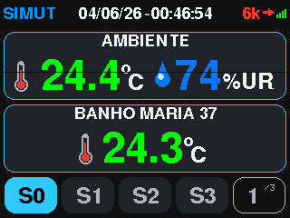
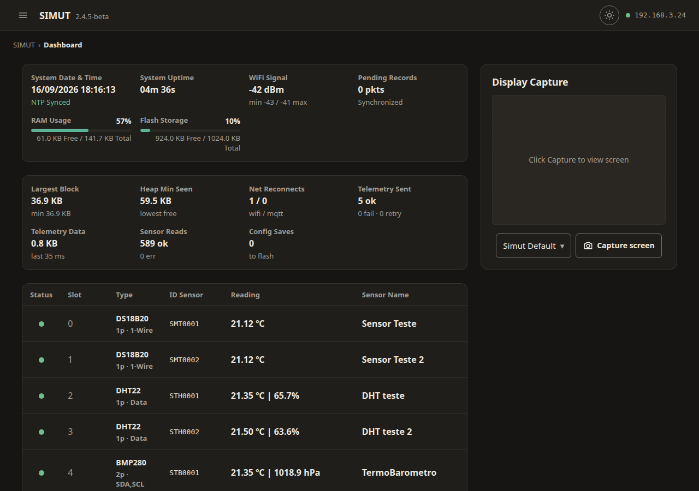

# SIMUT — Sistema Integrado de Monitoramento Universal e Telemetria

> Firmware IoT profissional para Raspberry Pi Pico W

[](LICENSE)
[](https://www.raspberrypi.com/products/raspberry-pi-pico/)
[](https://github.com/angeloINTJ/simut/actions/workflows/build.yml)
[](https://github.com/angeloINTJ/simut/releases)
[](CONTRIBUTORS.md)
[](CONTRIBUTING.md)

<p align="center">
  
</p>

## Capturas de Tela

| TFT Dashboard | TFT Demo | Web UI | Alpha Inicial |
|:---:|:---:|:---:|:---:|
|  |  |  | [](https://youtu.be/wLjghqId8nE) |

> 📸 Veja [docs/images/README.md](docs/images/README.md) para capturar telas do seu dispositivo.
>
> 🎥 O vídeo **Alpha Inicial** mostra o primeiro protótipo TFT + touch. A UI, temas, responsividade e acabamento evoluíram significativamente desde então — veja o GIF **TFT Demo** para a experiência atual.

[English version](README.md) | **Português**

## Visão Geral

O SIMUT é um firmware IoT profissional para **Raspberry Pi Pico W** que oferece monitoramento de temperatura e umidade em tempo real com arquitetura dual-core. Possui display TFT touchscreen, interface web com controle de acesso, telemetria (HTTP/MQTT), CLI via USB e Bluetooth, e suporte a múltiplos idiomas.

## Por que SIMUT?

| Necessidade | Sketch Arduino | ESPHome/Tasmota | **SIMUT** |
|-------------|:---:|:---:|:---:|
| Autônomo com display | ⚠️ Código manual | ❌ Sem suporte TFT | ✅ UI touch integrada |
| Ambientes regulados | ❌ Sem auditoria | ❌ Sem RBAC | ✅ Multi-usuário, logs |
| Cadeia fria (-80°C a +45°C) | ⚠️ Básico | ✅ Básico | ✅ Calibrado multi-sensor |
| Operação offline | ✅ Sim | ❌ Dependente de nuvem | ✅ Display + web local |
| Atualização OTA | ❌ Regravação manual | ✅ OTA | ✅ OTA + backup/restore |
| Segurança | ❌ Nenhuma | ⚠️ Básica | ✅ HMAC-SHA256, RBAC |

## Instalação Rápida

```bash
git clone https://github.com/angeloINTJ/simut.git
cd simut
pio run -e pico_w_release -t upload
```

## Documentação

| Documento | Descrição |
|-----------|-----------|
| [Manual do Usuário](docs/MANUAL.md) | Guia completo: hardware, display, web, CLI |
| [Guia OTA](docs/OTA_USAGE.md) | Atualização de firmware via web |
| [Guia de Recuperação](docs/RECOVERY.md) | Recovery após falha de OTA |
| [Política de Segurança](SECURITY.md) | Modelo de ameaças e procedimentos |
| [Contribuindo](CONTRIBUTING.md) | Guia para desenvolvedores |

## Hardware

| Componente | Especificação |
|------------|---------------|
| MCU | Raspberry Pi Pico W (RP2040) |
| Display | ILI9341 320×240 TFT (SPI) + XPT2046 touch |
| Sensores | DS18B20 (1-Wire, até 10) + DHT22 |
| Buzzer | Piezo passivo (PIO) |
| Armazenamento | 2 MB flash (1 MB firmware + 1 MB LittleFS) |

## Contribuidores ✨

Agradecimentos a estas pessoas incríveis:

<!-- ALL-CONTRIBUTORS-LIST:START - Do not remove or modify this section -->
<!-- prettier-ignore-start -->
<!-- markdownlint-disable -->
<table>
  <tbody>
    <tr>
      <td align="center" valign="top" width="14.28%"><a href="https://github.com/angeloINTJ"><br /><sub><b>Angelo Moises Alves</b></sub></a><br /><a href="https://github.com/angeloINTJ/simut/commits?author=angeloINTJ" title="Código">💻</a> <a href="https://github.com/angeloINTJ/simut/commits?author=angeloINTJ" title="Documentação">📖</a> <a href="#design-angeloINTJ" title="Design">🎨</a> <a href="#hardware-angeloINTJ" title="Hardware">🔌</a> <a href="#security-angeloINTJ" title="Segurança">🛡️</a> <a href="#maintenance-angeloINTJ" title="Manutenção">🚧</a></td>
      <td align="center" valign="top" width="14.28%"><a href="https://github.com/LorenzoLongaretto"><br /><sub><b>Lorenzo Longaretto</b></sub></a><br /><a href="https://github.com/angeloINTJ/simut/commits?author=LorenzoLongaretto" title="Testes">🧪</a> <a href="https://github.com/angeloINTJ/simut/commits?author=LorenzoLongaretto" title="Código">💻</a></td>
      <td align="center" valign="top" width="14.28%"><a href="https://github.com/JohnMartin0301"><br /><sub><b>John Martin</b></sub></a><br /><a href="#infra-JohnMartin0301" title="Infraestrutura">🚇</a> <a href="https://github.com/angeloINTJ/simut/commits?author=JohnMartin0301" title="Código">💻</a></td>
    </tr>
  </tbody>
</table>
<!-- markdownlint-restore -->
<!-- prettier-ignore-end -->
<!-- ALL-CONTRIBUTORS-LIST:END -->

Este projeto segue a especificação [all-contributors](https://allcontributors.org).

## Licença

MIT License — veja [LICENSE](LICENSE).

Copyright © 2026 Angelo Moises Alves
