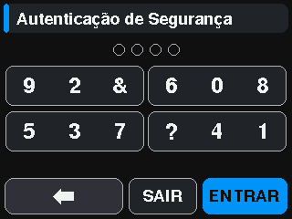
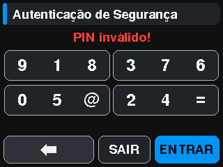
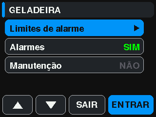
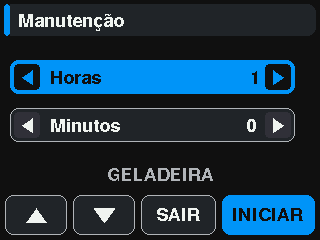
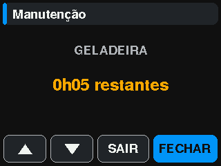
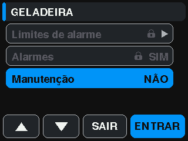
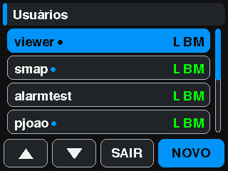
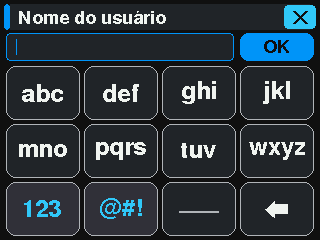
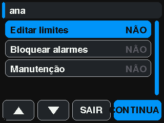

# SIMUT — User Manual

**Firmware:** v2.4.10-beta · **Hardware:** Raspberry Pi Pico W (RP2040 + CYW43439) · **License:** MIT
**Repository:** https://github.com/angeloINTJ/simut

> **This is beta software.** It is tested on real hardware, but it is not a
> certified metrological instrument. Do not make it the only control on
> regulated storage without validating it against your own reference.

Everything below was checked against a running device. Where a number is quoted
it was measured rather than estimated; where behaviour is untested or known to
be incomplete, the text says so rather than going quiet.

**Three builds share this manual.** Most of it describes the *release* build —
the one with the touch display. Two variants differ, and each is marked where
it does: the **alpha** build drives a 16×2 character LCD instead, and
**SIMUT Air** has no display at all and spends most of its life asleep on a
battery. §17 is about Air specifically; the alpha's differences are noted
inline.

---

## Contents

1. [What SIMUT is](#1-what-simut-is)
2. [Hardware](#2-hardware)
3. [First boot](#3-first-boot)
4. [Sensors and the slot model](#4-sensors-and-the-slot-model)
5. [The device display](#5-the-device-display)
6. [The web interface](#6-the-web-interface)
7. [Alarms](#7-alarms)
8. [History and logs](#8-history-and-logs)
9. [Users and permissions](#9-users-and-permissions)
10. [Telemetry](#10-telemetry)
11. [Backup and restore](#11-backup-and-restore)
12. [Firmware updates](#12-firmware-updates)
13. [The serial console](#13-the-serial-console)
14. [Recovery](#14-recovery)
15. [Specifications](#15-specifications)
16. [HTTP API reference](#16-http-api-reference)
17. [SIMUT Air — the battery build](#17-simut-air--the-battery-build)

---

## 1. What SIMUT is

A datalogger for temperature, humidity and pressure that runs entirely on one
Raspberry Pi Pico W. It reads up to sixteen sensors, draws them on a touch
display, serves its own web interface on your LAN, keeps an audit trail, and
can update its own firmware over the air.

There is no cloud component and no account. Telemetry to an external endpoint
exists but is off by default, and the device is fully usable having never been
given one.

**What it is not.** It is not certified for regulated storage, it has no
redundant sensing, and it holds no second firmware slot to fall back on. The
sections below are explicit about each of those limits where they matter.

### The three builds

The same source tree produces three images. They share the sensor model, the
history format, the web interface and the permissions; what differs is what is
attached and how much of the time the device is awake.

| Build | Display | Awake | For |
|---|---|---|---|
| **release** (`pico_w_release`) | 320×240 touch TFT | always | mains-powered installations with someone in front of the device |
| **alpha** (`pico_w_alpha`) | 16×2 character LCD | always | the same, on cheaper hardware; adds a Bluetooth console and an on-device AP mode |
| **Air** (`pico_w_air`) | none | ~13% of the time | battery installations that report and go back to sleep — see §17 |

The alpha build cycles its sensor slots on the two lines of the LCD, shows boot
progress as a bar, and carries a Bluetooth serial console because it has no
touch panel to enter AP mode from. Its Bluetooth is discoverable for **five
minutes after boot** and no longer, so an unattended unit stops advertising
itself; a phone that is already paired keeps connecting, and rebooting reopens
the window to pair a new one.

### Design in one paragraph

Two cores with a strict division. **Core 0** runs sensors, Wi-Fi, the web
server, telemetry, history and the serial console. **Core 1** does nothing but
drive the display, reading lock-free snapshots of shared state. That split is
why a busy network does not stutter the screen — and it is also the source of
the trickiest class of bug in the project, since a flash write must stop Core 1
before erasing anything it might be executing from.

---

## 2. Hardware

| Part | Specification |
|---|---|
| Microcontroller | Raspberry Pi Pico W — RP2040, dual Cortex-M0+, 264 KB SRAM, 2 MB flash |
| Wireless | CYW43439 (2.4 GHz Wi-Fi) — the radio blob occupies ~232 KB of the application slot |
| Display | ILI9341 320×240 TFT over SPI |
| Touch | XPT2046 resistive panel |
| Sensors | 16 slots on GPIO0–GPIO15 |
| Buzzer | Passive piezo, driven from PIO |
| Storage | On-chip flash: 1020 KB application, 1 MB filesystem, 4 KB metadata |

**GPIO allocation.** GPIO0–GPIO15 are available to sensors. GPIO16 and above
belong to the display, touch panel and buzzer, and the pin picker in the web
interface will not offer them.

Full pinout and assembly notes: [WIRING.md](WIRING.md).

---

## 3. First boot

1. **Flash the firmware.** Hold BOOTSEL while connecting the Pico over USB,
   then copy `simut_v2.3.2-beta.uf2` onto the `RPI-RP2` drive that appears. The
   board reboots into SIMUT by itself.

2. **Read the admin password.** On the first boot with no stored
   configuration, a random 8-character admin password is generated and printed
   **once** over USB serial at 115200 baud. Write it down — it is stored only
   as a salted hash, and nothing recovers it later except a reset.

3. **Join a network.** Configure Wi-Fi from the touch display. The device
   answers to mDNS, so it is reachable at `http://simut.local` as well as by
   IP. `show net status` over serial prints the address if you need it.

   > mDNS is on by default and costs 15,272 B of flash — measured, by linking
   > the image both ways. Set `SIMUT_MDNS=0` in `src/simut_config.h` to drop
   > it and reach the device by IP only.

4. **Change the password.** The first web login is forced through a password
   change before any page will load.

5. **Add sensors.** In the web interface under **System Config → Sensors &
   GPIO**, either add slots manually or use **Scan for probes** to discover
   1-Wire devices on a pin.

**A factory device provisions no sensors at all.** All sixteen slots come up
empty and claim no GPIO. This changed in v1.6.0-beta: earlier firmware
pre-activated slot 10 as a DHT22 on GP10, which made that pin unassignable on a
board that had no sensor there, and a factory reset put it back.

---

## 4. Sensors and the slot model

### One model, sixteen interchangeable slots

A slot is a position, not a role. Any slot takes any supported sensor, in any
combination, and none of them is special. What identifies a sensor is its own
**hardware ID** — so calibration offsets, alarm thresholds and history records
follow the physical device you wired, not the position you wired it into.

| Type | Bus | Channels | Pins per slot |
|---|---|---|---|
| DS18B20 | 1-Wire | temperature | 1 |
| DHT22 | single-wire | temperature, humidity | 1 |
| BME280 | I²C | temperature, humidity, pressure | 2 (SDA, SCL) |
| BMP280 | I²C | temperature, pressure | 2 (SDA, SCL) |

The BMP280 became a type of its own in v1.6.0-beta. Before that it shared
`TYPE_BME280`, which declares a humidity channel the part does not have — so
whichever chip you owned, the firmware was wrong about one of the two.

### Calibration

Each sensor carries one correction curve **per quantity it measures**, defined
by up to **5 calibration points**. A point pairs the raw reading with the value
a trusted instrument showed at the same moment. The correction is interpolated
between points and **held flat beyond the first and last** — the device never
extrapolates a slope outside the span you actually measured. One point is the
classic constant offset; zero points means **no correction** (the sensor's own
output stands), and the editor says so explicitly.

With 3+ points you can choose the **interpolation** per quantity: **Straight**
(piecewise linear, the default) or **Smooth** (a monotone cubic — Fritsch–
Carlson/PCHIP — on the offsets). Smooth bends through the anchors without ever
overshooting them: in every interval the correction stays inside the range the
two surrounding points define, and its slope flattens to zero at the first and
last anchors so it meets the held zones without a kink. Splines that overshoot
(Catmull-Rom, natural cubic) were rejected on principle — an overshoot is a
correction larger than anything the reference instrument ever showed.

The editor lives in the `/config` slot dialog, one block per quantity: the raw
and corrected readings side by side, the point rows, a capture button that
fills the raw field with the current reading, and **Remove correction** to
return to the sensor default. A point whose raw field is left empty is
captured from the live reading at the moment you save — that is the one-click
equivalent of the old single-reference flow. Points must have distinct raw
values (at two decimals) and both coordinates must sit inside the quantity's
plausible range; the panel warns as you type, with the same rules the firmware
enforces.

Everything is stored in `/calib.csv`, keyed by the 1-Wire ROM for a DS18B20
and by board serial + hardware ID for ROM-less parts. The canonical row is
`key,id,name,raw,ref[,raw,ref,…]` — everything a row has to say sits after
the name, one number per CSV column, so a spreadsheet opens the file
directly. A smooth curve adds a `cub` cell right after the name
(`key,id,name,cub,raw,ref,…`). Two other shapes coexist, told apart by field
count: `key,id,name` (a DS18B20 identity row with no correction) and the
legacy 4-column `key,id,offset,name` written by older firmware, which reads as
the constant offset it always was and is carried in that shape until real
points replace it — an offset with no known anchor has no point cells to
become. Older firmware reading a points row sees **no** correction (never a
wrong one).
Renaming a hardware ID migrates the rows; removing a correction deletes the
row, except for DS18B20 rows, which double as the ROM→ID/name database that
`sensor accept` reads.

**DS18B20 pairing is automatic.** A DS18B20 provisioned through the slot
editor is saved with the GPIO only; on the restart that follows Save &
Restart, the firmware reads the probe's ROM off the wire, adopts it into the
slot and re-keys the sensor's `calib.csv` row by that serial number —
migrating any correction saved while the sensor was unpaired. From that boot
on, the ROM is verified periodically and a swapped probe is quarantined
instead of silently impersonating the calibrated one. A probe that is absent
at boot simply pairs on the next restart.

Two identical DHT22s on one board calibrate independently, which was not true
before v1.6.0-beta: offsets for ROM-less parts used to be a single device-wide
row pair applied to whichever such sensor came first in the runtime list.

Corrections apply to the filtered reading (after the trimmed mean), so the
outlier rejection always operates on raw physical values, and every consumer —
display, history, alarms, telemetry — sees the corrected value.

Calibration requires the `CALIB` permission and needs NTP synced.

> **`/calib.csv` does not survive a firmware update.** See
> [§12](#12-firmware-updates) for what an update preserves and what it does not.

### Reading pipeline

Readings pass through a trimmed-mean sliding window of 10 samples before they
reach the display, history or telemetry. The DS18B20 resolution (9–12 bit) and
the sampling interval are set under **System Config → Hardware & Sampling**.

---

## 5. The device display

The panel is 320×240 with a resistive touch overlay. The firmware has 21
distinct UI modes. A full visual map — every screen, with the exact route to
reach it — is generated from a real device by
[`tools/screen_mapper.py`](../tools/screen_mapper.py) and published at
[docs/images/screens/screens.md](images/screens/screens.md).

The whole interface was visually redesigned in v2.1.5 (widgets, Latin-1
accents, DMA-composited rendering) and hardened in v2.1.10 so that every
screen keeps its content inside a 4 px safe area — the screen-alignment
offset (±4 px per axis, Settings → Screen alignment) can shift the image
without ever cropping anything.

### Dashboard

Two sensor cards — an upper panel and a lower panel — above a footer of up to
five buttons. Footer buttons select slots, page through them when more than
four are active, and open settings (**CFG**).

- **Tap a sensor card** to toggle its min/max view — anywhere on the card,
  on either panel.
- **Hold the upper card for three seconds** to pin it to the sensor it is
  showing, or to unpin it. Unpinned, the upper panel follows the slot selected
  in the footer; pinned, it stays on one sensor while the footer moves the
  lower panel. Pinning also leaves min/max. (Until v2.4.9-beta a quick tap on
  the right edge of the upper card did this too — it does not any more.)
- **Tap the graph icon** in the min/max view to open that sensor's history.
- **Tap CFG** to reach settings — this asks for **your PIN**.

### The PIN identifies who is at the panel

Since config v24 there is no device PIN: every account has its own, **4 to 8
digits**. The PIN is the identity — there is no username field — so it is
**unique** across accounts. The factory admin starts with `1234` and must
change it on its first visit to the menu (an upgraded device inherits the
display PIN it had, when it was numeric). Two wrong tries are free; the third
waits 5 s, then 15 s, 60 s, and the sixth locks the keypad until the next
reboot.

### The scrambled keypad

A fixed numeric pad hands the PIN to whoever is watching over your shoulder:
the finger positions are always the same ones. So the panel deals the ten
digits over **four cards of three glyphs** and **re-deals after every tap** —
a watcher cannot even tell whether two digits of the PIN are equal, because two
taps on the same spot are not the same three digits.

**When identifying, the whole card is one button.** One tap per digit, and the
tap says only *"one of these three"* — not even the device learns which. A
watcher sees four taps that, for a 4-digit PIN, stand for up to 81 different
PINs. On OK, Core 0 walks every string the sequence can spell and looks for the
one that belongs to an account; that is how it learns **who** is at the panel.
If two accounts match the same sequence, neither gets in — the panel has no way
to ask which was meant.

Ten digits in twelve slots would leave two cards visibly shorter, which is
itself something to read off the glass. The two spare slots take a **symbol**,
dealt with them: every card shows three glyphs, in the same ink as the digits.
A symbol is filler — the PIN is digits only, so a card holding one simply
counts for two digits when the search runs.

 

> **Setting a PIN is another screen**: an ordinary numeric pad, digits where a
> numeric pad puts them. Scrambling hides a PIN someone already has from
> someone watching; choosing one is the opposite problem, and hunting a digit
> through a shuffled deal only costs taps.

> ⚠️ **What it costs.** Any four taps cover 81 of the 10,000 four-digit PINs —
> against 32 accounts a blind guess has a ~26% chance of hitting one. Six
> digits bring that to ~2%, eight to ~0.2%. The lockout ladder (two free, 5 s,
> 15 s, 60 s, and the sixth failure locks until reboot) carries the rest. On a
> device with many accounts, use six digits or more.

> The pre-v24 keypad worked this way too, with one difference that mattered:
> it held the PIN in plaintext and planted the expected character in a random
> key among three decoys, so it only ever had to check one string. v24 stores a
> digest and identifies BY the PIN, so there is no expected character — which
> is why the device now walks the whole set of candidates instead.

PINs are set by the user (**Change Password** item), by an administrator in the
panel's **Users** item, on the `/users` web page, or with `user pin` on the CLI.

### Settings

Reached through CFG, after the PIN. The title says **who is in** — "Settings >
*name*" — because the panel session lasts until the tree is left and everything
done in it is signed with that name. The menu lists **only what the account's
bits reach**: themes, sounds, language, calibration and alignment want
`SYS_CONFIG`; **Alarms** wants any one of the three panel bits; **Users** wants
`USER_MGR`; one's own PIN, the license and the status screen are everyone's. An
alarm operator sees four items, the admin ten.

The fingertip keyboard of v2.1.9 — eight large group keys opening a popup with
both cases at once, any of 91 characters in two taps — is still how text is
typed here, which today means the name of a new account; the PIN has the keypad
above.

**System status** is the screen worth knowing: device name, firmware version,
board serial, uptime, free heap, flash usage and board temperature — the
fastest way to confirm what a device is actually running.

### Themes

The release build compiles one theme, but the device is not limited to it.
**Up to eight custom themes** live on the filesystem as `.thm` files in
`/themes` — plain text, one colour per role (24 roles, covering every element
the display draws: chrome, values, and the alarm/caution/selection state
colours plus the graph's date stamps), written as `#RRGGBB` or `0xRRGGBB`.
Missing keys fall back to safe stock values, so older 17-colour files stay
valid. Ready-made themes ship in [`data/themes/`](../data/themes/) — upload
the ones you want through the `/files` page.

Write your own with the editor in [`tools/theme-editor/`](../tools/theme-editor/).
It is a small web app that logs into the device, uploads a preview theme,
applies it and deletes it again — so the panel in front of you repaints as you
pick colours, rather than after an upload-and-reboot cycle.

Forty-nine further themes exist as build packs in `src/simut_config.h`
(`SIMUT_THEMES_HEALTH`, `_PRO`, `_MEDICAL`, `_SAFETY`, `_RETRO`, `_NATURE`,
`_UTILITY`). All seven are commented out by default; uncommenting one compiles
its palettes in at roughly 85 bytes each. Every built-in palette passes the
same contrast audit as the curated collection (small text ≥ 4.5:1, values
≥ 3:1 against their real backgrounds).

### History

The graph view plots one sensor over a selectable range (1H · 6H · 12H ·
24H · 7D), with navigation backwards and forwards in time, a calendar picker
and zoom. Since v2.1.8 the plot aggregates into time buckets with a real
min/max band around the average line — a one-minute spike cannot be sampled
out of the picture — and pressure sensors get a second axis in hPa (v2.1.7).
A numeric detail screen gives maximum, minimum, average and standard
deviation for the range on screen.

### While the web holds the device

When a web client is performing a long operation — streaming history, exporting
logs — the top bar shows the user holding it and **touch is rejected on the
dashboard** until it finishes. The banner is deliberate: it tells you why
before you touch rather than after.

---

## 6. The web interface

Served from the device itself. Log in at `http://simut.local` or the device IP.

| Page | What it does |
|---|---|
| `/` | Dashboard: system statistics, memory and flash usage, live sensor table, and a display capture panel that reads the physical screen |
| `/config` | Device identity, date and time, hardware and sampling, the GPIO map and sensor slots, telemetry |
| `/network` | Wi-Fi, static addressing, mDNS, NTP |
| `/alarms` | Per-sensor thresholds and actions |
| `/users` | Accounts and permissions |
| `/files` | Filesystem browser: upload, download, delete, create directories — plus full backup, restore and firmware update (OTA) |
| `/history` | History graphs, CSV export, and the system event log viewer |
| `/license` | License text |

### Authentication

Login is a two-step exchange: the browser fetches a nonce from
`/api/login_init`, hashes the password client-side, and posts the hash with the
nonce. The session is a `SIMUTSESS` cookie.

Two details matter if you are scripting against it:

- The page hashes **each UTF-16 code unit as one byte** — that is latin-1, not
  UTF-8. A password containing characters above U+00FF cannot be reproduced by
  a UTF-8 hash.
- Repeated failures trigger an exponential lockout measured in seconds.

### Serving the UI over HTTPS

The web server runs HTTPS when a certificate pair is provisioned, and plain
HTTP otherwise. Generate a per-device pair on your workstation (EC P-256 on
purpose — its handshake fits this heap where RSA-2048 would not):

```bash
openssl req -x509 -newkey ec -pkeyopt ec_paramgen_curve:prime256v1 \
  -keyout web_key.pem -out web_cert.pem -days 3650 -nodes -subj "/CN=simut"
```

The pair lives at `/config/web_cert.pem` and `/config/web_key.pem`, and there
are two ways to put it there.

**On a device in service — `POST /api/tls`.** Admin only, the same gate an OTA
apply carries, because a certificate decides who the browser trusts from the
next boot onwards. Send the two PEM blocks concatenated, in either order:

```bash
python3 tools/install_tls_cert.py --host 192.168.1.50 \
  --cert web_cert.pem --key web_key.pem --reboot
# or, by hand, once authenticated:
cat web_cert.pem web_key.pem | curl -X POST --data-binary @- \
  -H 'Content-Type: application/x-pem-file' http://192.168.1.50/api/tls
```

The device refuses the pair unless it parses **and the key belongs to the
certificate** — it derives the public key from the private one and compares it
with the certificate's, so a mismatched pair is a `400` now instead of HTTPS
quietly not coming up at the next boot, with the working pair already deleted.
A passphrase-encrypted key is named as such rather than called invalid. The
answer says what the next boot will serve; the running server is not switched
under you, so restart when it suits you.

This is the only route that writes into `/config`, and it is narrow on purpose:
two fixed paths, no filename taken from the request. The Files page still
refuses `/config` outright — since the 2026-08-29 audit, because a forged pair
in the credential store is a man-in-the-middle on the admin session after the
next reboot — and the manual pointed at it anyway for a month
([#133](https://github.com/angeloINTJ/simut/issues/133)).

**On a fresh unit — at first flash.** Place the two files under `data/config/`
and upload the filesystem image with `pio run -t uploadfs`, which reformats the
partition and is therefore only for a unit with nothing to lose. With the web port at its
default 80 the HTTPS listener moves to 443, so `https://<device-ip>` works; an
explicitly configured port is honoured as-is. The private key is never served
by `/download`, and `system format` clears it with the rest of `/config`.

What to expect:

- The certificate is self-signed, so the browser warns once — inspect and
  accept. The session cookie gains the `Secure` flag.
- Plain HTTP stops answering: there is one server and it now speaks TLS. A
  handshake costs about 0.5–0.7 s on this chip, and **one TLS client is
  served at a time** — a second simultaneous connection is dropped.
- A missing or unparseable pair can never lock you out: the device falls
  back to plain HTTP on the configured port. To turn HTTPS off, run
  `system https off confirm` on the USB console (§13) — it deletes the pair
  and reboots. Overwriting the key through the Files page is refused by the
  same guard that blocks uploading one.
- Firmware updates are still best performed over plain HTTP (§12): staging
  a ~1 MB image through TLS is slow on this chip and the documented
  recovery paths assume HTTP.
- **Switching HTTPS off, in the same browser:** once you have signed in over
  HTTPS the session cookie carries the `Secure` flag, and browsers refuse to
  send or overwrite a `Secure` cookie from a plain `http://` page. So the first
  sign-in after reverting to HTTP can bounce straight back to the login screen —
  the login accepted, but no session cookie reached the device. The login page
  detects this and says so; the fix is to open a private window, or clear this
  site's cookies (the session cookie is per-session, so simply closing and
  reopening the browser also clears it).

### Alarms, per sensor and per bit

The sensor list opens, for the selected sensor, a three-line menu — each line
behind its own bit, and a line the account lacks is drawn dimmed with a
padlock:

| Line | Bit | What it does |
|---|---|---|
| **Alarm limits** | `0x0400` | the limit editor; SAVE stores and sends `alarm_lim` with `lo`/`hi` |
| **Alarms ON/OFF** | `0x0800` | enables/disables the sensor's alarms; sends `alarm_on`/`alarm_off` |
| **Maintenance** | `0x1000` | opens a window in **hours and minutes** (30-day cap); inside it the sensor raises neither limit nor fault and the panel/buzzer stay quiet; shows the time left, END closes early |

   

Every action belongs to the identified user: it goes to the event log with
`ctx = account×100 + slot` and to the second telemetry line with `"user"`
(§10 and `docs/API_POST.md`). **Deactivate** on the alarm pop-up asks for the
PIN and the block bit too. The settings menu itself lists only what the
account's bits reach: an alarm operator sees four items, the admin ten.

### Users

A menu item for accounts holding `USER_MGR`. It lists the accounts — **except
the admin**, which has nothing here that can be changed: its bits are all of
them, it cannot be deleted, and its own PIN is the **Change Password** item of
its own menu. The letters **L B M** say which of the three panel bits an
account has; a dot after the name says it has a PIN. **NEW** creates an account in three
screens: name (keyboard), the three bits, PIN twice. An account created here is
**panel-only** — it cannot enter the web until an administrator grants it a page
bit and resets its password. Selecting an account opens the editor: the bits,
**Set PIN** and **Delete user** (with confirmation). A PIN that belongs to
another account is refused on the spot.

    

### Display capture

`GET /api/screenshot` returns a 320×240 24-bit BMP read back from the panel's
framebuffer over SPI. It is the real screen rather than a re-rendering, and it
is what the screen map in §5 is built from.

The **Live view** button next to it uses `GET /api/screen_stream`: the same
panel, one frame per request, in 8-row strips that are either palette-RLE
(one colour byte, one count byte) or raw, whichever is smaller. An average
frame is 9.5 kB instead of the BMP's 230 kB, and the mirror runs near one
frame per second because it reads each row once — the BMP capture reads three
times and votes, which is what makes it the forensic reference and what makes
it slow. An occasional wrong pixel is the price of the mirror; to check
colours, use the capture.

With the mirror running, **clicking it taps the panel**: the page converts the
click into panel coordinates and calls `POST /api/touch` with `x` and `y`. It is
the same injection the console's `touch sim` performs, and it faces the same PIN
keypad — reaching Settings asks for the display password exactly as it would for
a finger.

⚠️ A caller using `/api/touch` outside the page must **wait ~600 ms before
asking for the next frame**. A tap becomes an event Core 0 consumes in its loop,
and a capture occupies that same core, so a frame requested immediately
photographs the screen before the transition. The wait cannot live in the device
precisely because the device is what the request blocks.

---

## 7. Alarms

Each sensor slot carries its own thresholds and is enabled independently.
Thresholds are set from the web interface under `/alarms`, or on the device
under **Settings → Alarm Limits** — select a row, then tap its ON/OFF zone to
open the editor.

An alarm in progress raises the buzzer unless muted, marks the sensor on the
dashboard, and writes a record to the audit log.

**Global mute** lives on the device under **Settings → Alarm Sounds** and asks
for confirmation, because it silences every alarm channel at once.

---

## 8. History and logs

### History records

Readings are written to `/history/YYYYMMDD.h5` in a compact binary format
(**V5**). The recording interval defaults to one minute and is configurable
from 1 to 1440.

V5 records are keyed by **slot × channel**, not by hardware ID — renaming an
ID no longer stops the recording (that was a V4 behavior). The place a rename
does bite today is **calibration**: `/calib.csv` rows of ROM-less sensors are
keyed by hardware ID, so rename through the slot editor (which migrates the
rows) rather than by editing files. A slot added or renamed today still needs
`/api/history_rebind` (the button in the slot editor) to gain its column in
the day file that froze its schema at midnight.

Export is available as CSV from `/history`: since v2.1.8 the page downloads
the raw `.h5` day files (plus the open hour via `/api/history/open`) and both
the graph decimation and the CSV decoding happen in the browser — the device
only serves bytes. The `.simx` bundle endpoint `/api/export/history.bin`
remains reachable by URL for scripts, but it is no longer the CSV button's
path and it stops at the last sealed hour.

### Event log

The audit trail is a persistent binary log of 12-byte records:

| Field | Bytes | Notes |
|---|---|---|
| epoch | 4 | absolute timestamp |
| uptime | 3 | **seconds**, split across two fields, saturating at ~194 days |
| code | 2 | numeric event code |
| context | 2 | code-specific |
| flags | 1 | level and module |

The uptime column held whole hours until v1.6.2-beta, which meant any device
rebooting more than once an hour wrote zero into every record it ever made.
**Records written by older firmware read their old hours field as seconds** —
in practice zero, which is what that field already contained.

The log is viewable from `/history`, exportable as CSV, and dumpable over the
serial console with `show system log`. Note that the serial dump prints the
numeric code and context, **not free text**: the descriptive message for an
event exists only in the live serial output at the moment it happens.

---

## 9. Users and permissions

Thirty-two accounts maximum (config v24; it was five). Three web sessions
may be active at once. Each account may hold a **panel PIN** (4–8 digits,
unique), hashed with a device-wide salt because the panel looks accounts up
BY the PIN. Passwords are
hashed with a per-user random salt.

Thirteen permission bits, granted independently (the last three are the
panel's, §5; the web's alarms section keeps requiring `SYS_CONFIG`):

| Bit | Permission | Grants |
|---|---|---|
| `0x0001` | DASHBOARD | View live readings |
| `0x0002` | HISTORY | View and export history |
| `0x0004` | LOGS | View the event log |
| `0x0008` | SYS_CONFIG | Device and sampling configuration |
| `0x0010` | NET_CONFIG | Network configuration |
| `0x0020` | FILE_READ | Browse and download files |
| `0x0040` | FILE_UPLOAD | Upload files |
| `0x0080` | FILE_DELETE | Delete files |
| `0x0100` | USER_MGR | Manage accounts |
| `0x0200` | CALIB | Calibrate sensors |
| `0x0400` | ALARM_LIMITS | **Panel:** edit alarm limits |
| `0x0800` | ALARM_BLOCK | **Panel:** enable/disable a sensor's alarms |
| `0x1000` | MAINT | **Panel:** open/close maintenance |

**Admin is all bits set.** Three operations demand full admin rather than a
single bit: staging a firmware image (`/api/restore?op=stage`), applying it
(`/api/ota/apply`), and downloading the full backup (`GET /api/backup`).

---

## 10. Telemetry

Off by default. When enabled, the device posts readings to an endpoint you
specify.

| Setting | Options |
|---|---|
| Transport | HTTP POST, or MQTT |
| Payload | JSON, CSV, or a custom template |
| Security | TLS supported |
| Trigger | A minimum batch: the device transmits once that many records are waiting (0 disables telemetry) |
| Upload size | A maximum batch: a longer queue goes out in batches of that size until it is empty |
| Home Assistant Discovery | MQTT only, opt-in checkbox |
| Remote syslog | RFC 5424 over UDP, opt-in (see below) |

### Home Assistant Discovery

With the MQTT transport and JSON payload selected, checking **Home Assistant
Discovery** makes the device publish retained [MQTT Discovery](https://www.home-assistant.io/integrations/mqtt/#mqtt-discovery)
config messages on every broker connect. Home Assistant then creates the
device and one sensor entity per measurement automatically — temperature and
humidity per active slot, plus pressure — with availability driven by the
existing `<topic base>/status` will message. No YAML is needed on the HA side.

Entities appear after the first upload following a save (saving reboots the
device, and the configs ride the next broker connect). Unchecking the box
publishes empty retained payloads on the same topics at the next connect,
which removes the entities from Home Assistant. Renaming a sensor's hardware
ID re-registers it under the new id; the old entity lingers until the broker
retained topic is cleared or HA removes it manually.

### Prometheus metrics

`GET /metrics` serves the Prometheus text exposition format: live readings
per slot (temperature/humidity/pressure with `slot`/`hwid`/`name` labels),
heap and filesystem gauges, WiFi/MQTT state, the telemetry counters, and the
flash-op / Core-1 lifecycle counters. This is the **pull** complement to the
push telemetry above: the device stores and retries nothing — Prometheus
owns retention, graphing (Grafana) and alerting, and a failed scrape shows
up on its side as `up == 0`.

A scraper cannot run the login flow, so besides the normal session cookie
the route accepts **HTTP Basic** with a username and the **raw** password of
any account holding the dashboard permission. Failed credentials feed the
same per-IP exponential lockout as the login form. Each scrape verifies the
password in full (~0.7 s on the device), so keep `scrape_interval` at 15 s
or more:

```yaml
scrape_configs:
  - job_name: simut
    scrape_interval: 30s
    basic_auth:
      username: admin
      password: <your password>
    static_configs:
      - targets: ["<device-ip>"]
```

### Remote syslog (audit trail)

Off by default. When enabled (System Settings → *Remote Syslog*), the device
forwards each log event as an [RFC 5424](https://www.rfc-editor.org/rfc/rfc5424)
message over **UDP** to a syslog collector or SIEM. This is the audit trail a
regulated deployment needs: the on-device event log lives in a rotating ring
of at most ~1600 records, so a copy that leaves the box, append-only, is what
an auditor actually accepts.

| Setting | Meaning |
|---|---|
| Collector IP | The SIEM's **LAN IPv4** address — a hostname is not accepted (see below) |
| UDP port | Default 514 |
| Minimum level | Only records at or above this level are forwarded (Debug/Info/Warning/Error/Fatal) |

It is **not** a second telemetry transport, on purpose. UDP is
fire-and-forget: there is no handshake, no TLS client, no on-flash cursor and
no reconnection state — none of the machinery (or the failure modes) the
telemetry upload carries. The device never retries a datagram and never blocks
a reading on one; a `WARN`/`FATAL` raised just before a reboot is flushed on
the way out, but a hard hang of both cores saves nothing, and syslog promises
no delivery by design.

The collector is an **IPv4 address, not a hostname**: the setting lives in an
8-byte slot with no room for a 64-character name, a collector on the same LAN
is addressed by IP in practice, and it avoids a DNS-resolution failure path in
the logging hot loop.

Each line maps mechanically to RFC 5424: the SIMUT level becomes the syslog
severity (facility `local0`), the tag (`NET`, `CLI`, …) becomes APP-NAME, the
numeric log code becomes MSGID (stable and language-independent — map it back
with the code table below), and the context/core/uptime ride a structured-data
element. **Before the clock syncs**, the timestamp is the RFC 5424 NILVALUE
`-` rather than the provisional build-epoch date, so a line never arrives at
the SIEM stamped in the past. A record sanitised to fit one datagram:

```
<132>1 2026-08-19T17:04:00Z picofridge NET - 524 [simut@32473 ctx="-18" core="0" up="12345"] Provisional time in use
```

The structured-data ID uses enterprise number `32473` — the value IANA
reserves for examples — because SIMUT has no registered PEN; a site that
registers one swaps that single constant.

### Template tokens

| Token | Resolves to |
|---|---|
| `{TS}` | Timestamp |
| `{DEV}` | Device name |
| `{t0}`…`{t15}` | Temperature of slot N |
| `{u0}`…`{u15}` | Humidity of slot N |
| `{p0}`…`{p15}` | Pressure of slot N |
| `{DHT_ID}` | Hardware ID of the DHT sensor |

The tokens `{tAMB}`, `{uAMB}` and `{pAMB}` were removed in v1.6.0-beta along
with the privileged ambient slot they resolved through. Use the numbered slot
tokens instead.

Records that cannot be delivered are queued; the dashboard shows the pending
count.

---

## 11. Backup and restore

`GET /api/backup` downloads the whole filesystem as a single `.bkp`. The format
carries a CRC32 over the payload and is **bound to the chip ID**, so an image
cannot be restored onto a different board by accident.

Restore is `POST /api/restore` — `op=validate` checks an image without writing,
`op=apply` writes it. A successful apply reboots the device so nothing keeps a
stale cache of what was on flash.

**Take a backup before every firmware update.** §12 explains why.

---

## 12. Firmware updates

### Read this first

**Over-the-air updates work from v1.6.2-beta onward, and only from there.**
Every earlier build shipped an applier whose watchdog feed wrote the reset bit
instead of reloading the counter: it rebooted the chip before copying a single
sector, while every layer above it reported success. The symptom was a device
that announced a successful update and kept running the old firmware.

A device already on v1.6.2-beta or later can take this release over the air.
Anything older is still running the broken applier and has no over-the-air path
off it: flash v1.6.2-beta or later over USB once, and updates work normally from
then on.

### What an update destroys

Staging shares the flash partition with the filesystem, so an update
**reformats it**. A snapshot carries `/config/system.bin` across — Wi-Fi
credentials, users and sensor slots survive automatically, and the device
rejoins the network unattended.

Nothing else does. **Language packs, `/calib.csv` and all stored history are
lost.** Download a backup first.

### There is no rollback

The application slot is single. The image is validated before it is committed
and verified again on the next boot, but if a bad image boots badly there is no
second slot to fall back to — recovery is the BOOTSEL button and a USB cable.
See [RECOVERY.md](RECOVERY.md).

### The procedure

From the web interface: the firmware update panel on the **`/files`** page,
next to Backup and Restore. Or directly:

```bash
# 1. Stage — uploads and validates. ~29 s for a 957 KB image.
curl -b cookies.txt -F "file=@simut_v2.3.2-beta.bin" \
     "http://simut.local/api/restore?op=stage&commit=1"
# -> {"st":5,"bytes":957696,"crc32":"...","v":0,"dsize":957500,"dcrc":"...","committed":1}

# 2. Apply — answers 202 immediately, then tears down and reboots.
curl -b cookies.txt -X POST "http://simut.local/api/ota/apply"
# -> {"accepted":true,"mode":"apply"}
```

Staging must report `committed: 1` and `v: 0` before apply will do anything.
`/api/ota/apply` answers **409** when no validated update is pending.

Note that `bytes` and `dsize` differ, and should: `bytes` counts the 0xFF
padding that closes the final 256-byte page, which is what the applier copies,
while `dsize` and `dcrc` describe the bytes that actually arrived.

### What is checked

| Stage | Check |
|---|---|
| Upload | Size between 100 KB and the 1020 KB application slot |
| Upload | CRC32/MPEG-2 over the first 252 bytes against the 4 bytes that follow — the same check the RP2040 boot ROM performs, so a file that is not a valid RP2040 image is rejected before anything is erased |
| Apply | The applier copies staging into the application slot from SRAM, with interrupts off |
| Next boot | The installed image is CRC-checked against the metadata and the verdict logged |

The post-apply verdict appears on the serial console as
`[INF][OTA] image verified, NNNNNN B`. It exists there and nowhere else — the
persistent log stores only the numeric code, so after the fact the level
(`INF` versus `ERR`) is what distinguishes success from a mismatch.

### Measured behaviour

21 consecutive updates on the bench, all successful:

| Stage | Time |
|---|---|
| Upload and stage (957,500 B) | 29.2 s ± 0.07 (32.1 KiB/s) |
| `/api/ota/apply` → 202 | 0.1 s |
| Applier window — erase and program | 25.1 s ± 0.10 |
| Reboot → image verified | 9.4 s ± 0.06 |
| **Web interface unreachable** | **48.4 s** |

Roughly two thirds of the downtime is the applier; the rest is Wi-Fi
re-associating. Free heap moved 24 bytes across the whole run, and no boot
produced a panic.

Revalidated on the 2.1 line (v2.1.9): two full stage+apply cycles with a
1,001,964 B image, 30.7 s per stage, apply accepted first try both times, and
the verdict read back as the version string — never inferred from timing.

---

## 13. The serial console

USB CDC at **115200 baud, 8N1**, DTR asserted. The console exists in two
profiles, and which one you have depends on the firmware build:

| build | console |
|---|---|
| `pico_w_release`, `pico_w_alpha` | the emergency console, fourteen commands |
| `pico_w_test` | the full console, 56 commands and four modes |
| `pico_w_test_https` | the full console, plus the TLS server — the bench image for anything HTTPS |
| `pico_w_air` | the full console, since 2026-09-18 — see below |

### Release firmware — fourteen commands

The image users run ships a recovery console, not a configuration interface.
Configuration lives in the web UI.

| Command | Purpose |
|---|---|
| `show net status` | IP, signal, buffer pool, send aborts |
| `show system info` | Device, firmware, serial, Wi-Fi, timezone, NTP |
| `show system log` | Dump the event log |
| `debug on` / `debug off` | Verbose logging for this session |
| `system admin reset` | Reset the admin password to a random one |
| `system format` | Erase the filesystem |
| `system https off` | Disable HTTPS (delete the certificate pair), fall back to HTTP |
| `system factory` | Restore factory defaults |
| `system ssid <name>` | Set the Wi-Fi network name — **saved immediately** |
| `system pass <secret>` | Set the Wi-Fi password — **saved immediately** |
| `system cors <origin>` / `off` | Allow the web fleet manager page at that origin to reach this device from a browser — **written immediately**, takes effect on the next boot |
| `ap` | Start the setup access point — **WPA2**, key printed on this console |
| `reload` | Reboot |
| `help` | List these |

The two Wi-Fi commands are how a headless unit is moved to another network:
set them, then `reload confirm` to reconnect.

Destructive commands require `confirm` as a final word, and four of them —
`system factory`, `system format`, `system admin reset` and `system https off` —
are **refused over Bluetooth**. They are recoveries, and a recovery you can
reach over the radio only helps somebody who is already in.

> **Most changes here do not persist.** The emergency console has no
> `write memory`, so what it changes applies to the running session and is gone
> at the next reboot. `debug on` is the case that behaves that way on purpose.
>
> **Three commands are exceptions and save immediately:** `system ssid`,
> `system pass` and `system admin reset`. The network ones always did; the
> password reset did not until this release, and on a SIMUT Air — where every
> wake is a boot — the password it printed expired about a minute later, which
> made the one recovery for a locked-out web recover nothing. It now writes to
> flash before it prints, and says `NOT SAVED: valid only until reboot` if the
> write fails.

The password it prints is random, 8 characters from an alphabet without O/0 and
I/1, shown **once**. The next web login is forced through a password change.

This console replaced a 56-command one in v1.5.6-beta. The commands that were
cut had web equivalents already, and removing them returned 44.5 KB of flash.

### Test firmware — the full console

`pico_w_test` builds ship the 56 commands with Cisco-style modes
(`enable` → `configure terminal` → `write memory`), plus `touch sim` and
`screen` for driving the display from a script. It is the build the automated
suites under `tools/` require. It is not what belongs on a device someone uses.

**The SIMUT Air ships it too, since 2026-09-18.** That build is headless: the
serial and Bluetooth console is the only local interface it has, and answering
"the settings live in the web UI" to someone holding a cable is an answer that
helps nobody when the web is exactly what cannot be reached. It was on the
emergency console until now for one reason — the full CLI costs 45,056 B and
the image had 876 B to spare when the decision was taken. The v2.4.9-beta diet
freed 62,420 B on it; `write memory` and the four modes work there as they do
on `pico_w_test`, and the five `air` commands stay where they were.

Full reference: [CLI-Manual.md](CLI-Manual.md) *(in Portuguese)*.

### Bluetooth

**Not in the release firmware** — `BluetoothManager.cpp` is excluded from that
build. It *is* compiled into the **alpha** and **Air** images, where there is no
touch panel to start AP mode from, and it authenticates with the admin's web
password.

That console has the same exponential lockout as the web login — 2 s after the
first wrong password, doubling to a 300 s ceiling — held in RAM, so dropping and
reopening the link does not reset it. Discovery closes five minutes after boot.
Of the recovery commands only `ap` is allowed over the link.

---

## 14. Recovery

| Symptom | What to do |
|---|---|
| Forgot the admin password | `system admin reset confirm` over **USB serial** (the command is refused over Bluetooth), then log in with the printed password — the web forces you to change it. Since this release the reset survives a reboot, so there is no rush |
| Answers on serial but not on the network | `show net status` — with no IP, reconfigure Wi-Fi from the display |
| Blank screen after adjusting the display offset | Fixed in v1.6.2-beta. On older firmware a factory reset clears the stored offset |
| Update reported success but the version did not change | The applier defect described in §12. Flash v1.6.2-beta over USB |
| Does not enumerate over USB at all | BOOTSEL rescue — see [RECOVERY.md](RECOVERY.md) |

---

## 15. Specifications

### Limits

| | |
|---|---|
| Sensor slots | 16 (GPIO0–GPIO15) |
| Channels per sensor | 4 (temperature, humidity, pressure, lux) |
| Pins per sensor | up to 4 |
| User accounts | 5 |
| Concurrent web sessions | 3 |
| Permission bits | 10 |
| Averaging window | 10 samples, trimmed mean |
| TFT graph points | 200 |
| History interval | 1–1440 minutes, default 1 |

### Flash layout

| Region | Offset | Size |
|---|---|---|
| Application | `0x000000` | 1020 KB |
| Staging / LittleFS | `0x0FF000` | 1024 KB |
| Config snapshot | `0x1FD000` — the last 8 KB of staging (sectors 254–255) | 8 KB |
| OTA metadata | `0x1FF000` | 4 KB |

The staging area and the filesystem are the same physical region. That is why
an update reformats the filesystem. The configuration snapshot sits in the last
two sectors of that region, which is also why an image is only accepted up to
1016 KiB: anything larger would have its tail where the snapshot is written.

### Build

| | |
|---|---|
| Firmware size | 1,011,244 B — ~97% of the 1020 KB application slot |
| RAM at link | 123,124 B of 262,144 B |
| Free heap in service | ~43.3 KB, of which ~26.6 KB is the largest contiguous block — the figure BearSSL actually needs. Reference rig on v2.3.2-beta over HTTP, five sensors and the pt-BR language pack, 16 h uptime: 44,364 B free against a 44,196 B low-water mark, so the heap is flat rather than merely large. Serving the UI over HTTPS reserves a further ~21.5 KB for the static TLS pool at startup. |
| Radio firmware | ~232 KB of the application slot |

---

## 16. HTTP API reference

All routes require an authenticated session unless noted. Permissions in
brackets.

### Session

| Route | Method | Notes |
|---|---|---|
| `/api/login_init` | GET | Returns a nonce. **Open, no session required** |
| `/api/login` | POST | `user`, `pass` (sha256, latin-1), `nonce` |
| `/api/login_chpass` | POST | Change password at login |
| `/api/force_chpass` | POST | Complete a forced password change |
| `/logout` | GET | End the session. Reads the `SIMUTSESS` cookie **or** `Authorization: Bearer` — a browser page on another origin can only send the latter. Answers 204 to the Bearer caller, 302 to `/login` to the cookie one |

### Reading state

| Route | Method | Notes |
|---|---|---|
| `/api/status` | GET | Uptime, heap, flash usage, RSSI; `sys.ver`, `sys.env`, `sys.uid`, `sys.mac`, `sys.cfg` identify the device (§ Fleet hooks). `?quiet=1` reads without rearming the Air timer |
| `/metrics` | GET | Prometheus text exposition [DASHBOARD]. Session cookie **or** HTTP Basic (username + raw password) — see §10 |
| `/api/sensors` | GET | Slot map and drivers (not readings — those are in `/api/status`) |
| `/api/config` | GET | Device configuration |
| `/api/network` | GET | Network configuration |
| `/api/alarms` | GET | Thresholds |
| `/api/users` | GET | Accounts [USER_MGR] |
| `/api/perms` | GET | Permission bits of the session |
| `/api/sec_status` | GET | Lockout and security state |
| `/api/themes` | GET | Available themes |
| `/api/lang` | GET | Language dictionary |

### History and logs

| Route | Method | Notes |
|---|---|---|
| `/api/history_multi` | GET | Records for a range [HISTORY] |
| `/api/history/open` | GET | The still-open in-RAM hour as a single-block V5 stream [HISTORY] |
| `/api/history_days` | GET | Which days hold data |
| `/api/history_rebind` | POST | Re-point records at a new hardware ID |
| `/api/export/history.bin` | GET | Raw binary export |
| `/api/logs` | GET | Event log [LOGS] |
| `/api/export/logs.bin` | GET | Raw binary export |
| `/api/clear_logs` | POST | Erase the log |

### Files

| Route | Method | Notes |
|---|---|---|
| `/api/ls` | GET | List a directory — the parameter is `dir` |
| `/api/upload` | POST | Upload [FILE_UPLOAD] |
| `/api/delete` | POST | Delete — the parameter is `file` [FILE_DELETE] |
| `/api/mkdir` | POST | Create a directory |
| `/download` | GET | Download a file [FILE_READ] |

### Configuration

| Route | Method | Notes |
|---|---|---|
| `/api/save_sys` | POST | Save system configuration [SYS_CONFIG] |
| `/api/commit_all` | POST | Apply a batch of changes. `_dry=1` validates `sys`/`net` on a copy and answers `{"status":"dry","rejected":[…]}` without saving or rebooting |
| `/api/set_time` | POST | Set the clock |
| `/api/calib` | GET/POST | Calibration offsets [CALIB] |
| `/api/action` | POST | Multiplexed actions — `tel_sync`, `tel_reset`, `sensor_scan`, `scan_results`, `sensor_accept`, `sensor_wipe`, `reboot` |
| `/api/reset_touch_cal` | POST | Clear touch calibration |

### Firmware and backup

| Route | Method | Notes |
|---|---|---|
| `/api/backup` | GET | Download the filesystem as `.bkp` — **admin only** |
| `/api/restore` | POST | `op=validate` \| `op=apply` \| `op=stage&commit=1` — **stage is admin only** |
| `/api/ota/apply` | POST | Apply a staged update — **admin only**, answers 202 |

### Fleet hooks

What a manager of many devices (the SIMUT-RX app, or any client) relies on:

| Where | What | Why |
|---|---|---|
| `/api/perms` | `env` (`release`/`alpha`/`air`), `mc` (password change pending) | pick the right OTA image; learn about a pending 409 before the first write |
| `/api/status` → `sys` | `ver`, `env`, `uid` (board serial), `mac`, `cfg` (CRC-32 of the configuration in RAM) | one `PERM_DASHBOARD` read identifies, versions and fingerprints the device; two devices with the same `cfg` have the same configuration |
| Telemetry POST headers | `X-SIMUT-Uid`, `X-SIMUT-Ver`, `X-SIMUT-Env`, `X-SIMUT-Cfg` | a receiver correlates the source address with the device without opening a session; the payload is unchanged |
| mDNS | `_simut._tcp` with TXT `uid`, `ver`, `env`, `tls` | discovery by browse, passive, without touching the web server |
| `.bin` | the string `SIMUT-ENV:<env>;v=<version>;` in `.rodata` | a client checks the file before uploading; the device checks the staged image (`v=7`, `ENV_MISMATCH`) before accepting it; images up to **1016 KiB** |
| `commit_all` | `_dry=1`; non-string values and bad addresses land in `rejected` | validate a template on N devices before N reboots; nothing is erased under a 200 |
| `Authorization: Bearer <SIMUTSESS>` | the session without a cookie jar | see `AUTHORIZATION.md` |

### Display

| Route | Method | Notes |
|---|---|---|
| `/api/screenshot` | GET | 320×240 24-bit BMP off the panel |
| `/api/screenshot_chunk` | GET | One 16-row chunk with a CRC32, for verifiable transfer |
| `/api/screen_stream` | GET | One frame of the panel in palette-RLE strips (live mirror) |
| `/api/touch` | POST | Taps the panel at `x` (0..319), `y` (0..239) — panel coordinates |

---

## 17. SIMUT Air — the battery build

`pico_w_air` is the same firmware with the display compiled out and a
hibernation cycle added. It is meant for a place with no mains and nobody
standing there: it wakes on a clock, reads its sensors, writes the reading to
flash, and goes back to sleep. It brings the radio up only when it has enough
readings to be worth sending.

> **Experimental.** The cycle and its energy numbers are measured on the bench
> rig, not in a field installation. Nothing about it is certified, and the
> current draw quoted below is arithmetic on bench measurements of the *time*,
> not a measurement of the current itself.

### Two modes

| | **M0 — operational** | **M1 — the cycle** |
|---|---|---|
| Radio | up | only on a telemetry wake |
| Web server | running | **not started** |
| Bluetooth, mDNS | running | not started |
| Serial console | full | answers, but the window is seconds |
| Ends when | `air idle` expires with no activity | you run `air stop`, or the charger is detected |

A **cold boot** — power applied, RUN, `reload`, an OTA — is read as *somebody is
standing there* and lands in M0 with the whole `air idle` to work in. A boot
that came out of hibernation goes straight back into the cycle.

### Commands

| Command | What it does |
|---|---|
| `air status` | One line: phase, wake period, history interval, idle, armed, pending telemetry, radio, charger, battery |
| `air hibernate` (`air sleep`) | Arm the cycle and enter it now |
| `air stop` (`air wake`) | Cancel the cycle, return to M0, disarm it in flash |
| `air idle <10..65535>` | Seconds of quiet in M0 before it hibernates by itself |
| `air charger <0..29 \| off>` | GPIO that reads high when the charger is connected |

`air status` reads like this:

```
Air: phase=0 wake=60s hist=60s backoff=0s idle=300s armed=1 dirty=0
     tel=31/5 skip=0 radio=1 chg=0 bat=50 cyc=4038ms wip=1
```

`phase=0` is M0. `armed=1` means the cycle is recorded in flash and will resume
by itself after a reset — that is deliberate, so a unit that reboots in the
field does not stay awake until the battery is flat. `tel=31/5` is 31 records
waiting against a minimum batch of 5.

### What a wake costs

Measured on the rig with a 60 s history interval, one DS18B20 at 12-bit:

| | |
|---|---|
| Wake, reading only | **9.31 s** — of which 6.83 s is the sensor's own conversion time |
| Wake with telemetry | ~12.7 s |
| Asleep | ~51 s |
| Measured period | 60.5–60.6 s against a 60 s setting |
| Duty cycle | ~13% |

Against the bench currents (25 mA reading, 80 mA transmitting, 2 mA asleep), one
reading a minute and telemetry every fifth wake, that is about **8.2 mA average
and 17 days on a 3400 mAh 18650** — arithmetic, not a measurement.

**Where the time goes.** Two thirds of a wake is the ten-sample averaging window
filling from empty, and the DS18B20 takes 750 ms per conversion at 12-bit
resolution. Lowering `MOVING_AVG_WINDOW` or the sensor resolution is the lever
that remains, and both change the recorded number, so neither is done for you.
⚠️ Note also that the driver currently waits a fixed 750 ms whatever resolution
is configured, so **lowering the resolution today costs precision and returns no
time** until that wait follows the setting.

### Things that surprise people

- **It disappears from USB while it sleeps.** Deep sleep detaches the device.
  A port that vanishes mid-command is the cycle working, not a crash.
- **The web is only up in M0.** A wake does not start the listener, so
  `http://<ip>/` refuses the connection for most of every minute. Run
  `air stop` over serial first, or catch a cold boot.
- **Only an authenticated request holds it awake.** An anonymous poll gets a
  budget of three extensions per boot and no more, so a monitoring probe cannot
  keep a battery unit up forever. Logging in resets the idle timer on every
  request, which is what gives an operator their window.
- **The charger cancels the cycle.** A wake that finds the configured pin high
  brings up full M0 instead. The cycle stays armed in flash, so unplugging and
  letting `air idle` expire puts it back to sleep with nothing to re-enable.
- **A wake writes one log record, not eight.** The eight boot-init records are
  suppressed on a wake — they describe a boot that already happened — and a
  cold boot still writes all of them plus `APP_AIR_COLD_BOOT`. If you see that
  code in the field, the device lost power.

### Telemetry on a battery

The trigger is **quantity**, not time. `t_int` is the minimum batch: the radio
stays off until that many records are waiting. `t_bat` caps how many go in one
upload. With `t_int=5` and a reading a minute, seven of every eight wakes never
power the radio at all — which is the point, since the radio is the most
expensive thing a wake can do.

---

## Getting help

- [Wiring and pinout](WIRING.md)
- [Recovery](RECOVERY.md)
- [Over-the-air updates](OTA_USAGE.md)
- [Glossary](GLOSSARY.md)
- [Serial console reference](CLI-Manual.md) *(Portuguese)*
- [Screen map](images/screens/screens.md)
- [Report a bug](https://github.com/angeloINTJ/simut/issues/new?template=bug_report.md)
- [Security policy](https://github.com/angeloINTJ/simut/blob/main/SECURITY.md)
