# SIMUT — Manual Completo do Sistema

**Versão:** v3.44.0-alpha13
**Hardware:** Raspberry Pi Pico W (RP2040 + CYW43)
**Data:** 2026-05-08

> **Status do manual:** STUB documentando arquitetura, telas e fluxos baseado em código + dados. Screenshots TFT + browser ficam como placeholders — gerar em próxima sessão via:
> - `GET /api/screenshot` (já implementado, retorna BMP 320×240) para display
> - Headless Chrome/Selenium para browser
> - Comando serial novo `touch sim X Y` para simular toque (não implementado ainda)

---

## 1. Visão Geral

SIMUT é um sistema de **monitoramento de cadeia fria laboratorial/médica** para vacinas, plasma, banhos-maria, estufas e congeladores. Roda em Raspberry Pi Pico W com:

- Display TFT 320×240 (ILI9341) com touch resistivo (XPT2046)
- Até **10 sensores DS18B20** (1-Wire) + 1 SHT31 (I2C ambiente)
- Web UI completa (login, dashboard, histórico, alarmes, configuração)
- Telemetria HTTP/MQTT
- Histórico binário em LittleFS (1 ponto/min, ~1 ano de dados)
- OTA via web (firmware self-flash)
- Bluetooth LE (controle remoto)

### Cenário hipotético deste device

Conteúdo de `data/calib.csv` (chip `E6642815E34C1824`):

| Sensor ID         | Slot ID    | Offset | Nome                       |
|-------------------|------------|--------|----------------------------|
| (interno SHT31)   | tSTH0001   | 0.0°C  | Temperatura ambiente       |
| (interno SHT31)   | uSTH0001   | 0.0%   | Umidade ambiente           |
| 28600779000000B7  | STM0001    | 0.0°C  | BANHO MARIA 37             |
| 28ADD07A000000E5  | STM0002    | 0.0°C  | BANHO MARIA 45             |
| 28293E7900000023  | STM0003    | 0.0°C  | ESTUFA 25                  |
| 28E0B27B000000C7  | STM0004    | 0.0°C  | ESTUFA 37                  |
| 287CE07A00000092  | STM0005    | 0.0°C  | GELADEIRA DE VACINAS       |
| 2872F57B000000A0  | STM0006    | 0.0°C  | FREEZER 1                  |
| 281A2C7900000068  | STM0007    | 0.0°C  | GELADEIRA COPA             |
| 285C1C790000002B  | STM0008    | 0.0°C  | FREEZER 2                  |
| 28BF2379000000B0  | STM0010    | 0.0°C  | ESCONDERIJO SECRETO        |
| 283C217900000080  | STM0009    | 0.0°C  | GELADEIRA DE PLASMA        |

12 sensores, 10 setpoints típicos:
- Banho-maria 37°C / 45°C
- Estufa 25°C / 37°C
- Geladeira de vacinas (~5°C)
- Freezer 1, 2 (~-20°C)
- Geladeira COPA (~5°C)
- Geladeira de plasma (~-30°C)
- "ESCONDERIJO SECRETO" (apelido de operador)

---

## 2. Hardware

### 2.1 Raspberry Pi Pico W

- RP2040 dual-core ARM Cortex-M0+ @ 133 MHz
- 264 KB SRAM, 2 MB Flash externa QSPI
- WiFi 802.11n (CYW43439 chip externo via SPI)
- Bluetooth LE 5.2 (compartilha CYW43)
- USB CDC para CLI e flash

### 2.2 Pinout (do código)

| Função            | GPIO | Descrição                          |
|-------------------|------|------------------------------------|
| TFT CS            | 28   | Display ILI9341 chip select        |
| TFT DC            | 27   | Display data/command               |
| TFT RST           | 26   | Display reset                      |
| TFT MOSI/SCK      | SPI0 | Display SPI (auto)                 |
| TOUCH CS          | 21   | XPT2046 chip select                |
| TOUCH IRQ         | 22   | XPT2046 pen IRQ                    |
| OneWire (DS18B20) | 11..20 | Pinos por sensor (10 slots)      |
| Buzzer            | 9    | PWM piezo                          |
| LED status        | 25 (LED_BUILTIN) | Heartbeat               |
| BOOTSEL trigger   | -    | (botão físico ou via PicoHand GP0) |
| RUN reset         | -    | (botão físico ou via PicoHand GP1) |

### 2.3 PicoHand (mão robótica)

`tools/PicoHand/` — outro Pico dedicado conecta GP0/GP1 do alvo para BOOTSEL/RESET via comandos serial USB CDC. Permite recovery automatizada sem intervenção manual.

Comandos:
- `PING` → `PONG` (health check)
- `RESET` → pulso 50ms RUN (reboot)
- `BOOTSEL` → BOOTSEL+RESET seq (entra em modo flash)
- `HOLD <BOOTSEL|RESET>` / `RELEASE <BOOTSEL|RESET>` (controle manual)
- `STATUS`, `PINOUT` (diagnóstico)
- `SELF_BOOTSEL` (reflasha a própria mão)

---

## 3. Arquitetura de Software

### 3.1 Modelo dual-core

- **Core 0** (main): boot, web server, CLI, sensors, telemetry, alarms
- **Core 1** (display): TFT render loop, touch input, gestures

Sincronização via `multicore_lockout` (IRQ) ou cooperative quiet mode (`requestQuietMode` → `multicore_reset_core1`).

### 3.2 Módulos principais (managers)

| Manager           | Responsabilidade                              |
|-------------------|-----------------------------------------------|
| AppManager        | Coordenação geral, setup/loop, sensor read    |
| StorageManager    | LittleFS, config encrypted, history binário   |
| DisplayManager    | TFT render Core 1, touch, gestures, telas     |
| NetworkManager    | WiFi connect, AP mode, DHCP, NTP              |
| WebManager        | HTTP server, auth, 50+ rotas (web + API)      |
| CommandManager    | CLI parser USB Serial + Bluetooth             |
| LogManager        | Eventos persistidos, autopsia HW WDT          |
| BluetoothManager  | BLE GATT services                             |
| AlarmManager      | Detecção setpoint, ações, mute                |
| TelemetryManager  | HTTP POST batch, MQTT publish                 |

### 3.3 Layout do flash (2 MB)

```
0x10000000 ─┬─ Boot2 (256 B) + Code/RO Data       ─ 1020 KB ── Slot A (firmware ativo)
0x100FF000 ─┴─ EEPROM emulada (4 KB, NÃO USADO — F-OTA usa)
            ┌─ OTA Metadata (4 KB)                ─ 1 setor
0x10100000 ─┤  Staging area                       ─ 1024 KB
            │  (usado durante OTA: novo firmware) 
            │  (último setor 0x101FE000 = snapshot config 4 KB)
            └─ LittleFS                           ─ 0 KB (overlap c/ staging)
```

(Layout aproximado — F-OTA reformata LittleFS post-apply pra recuperar staging.)

---

## 4. Telas do Display TFT (Core 1)

A interface TFT é **resolução 320×240 paisagem**, organizada em telas-foco navegáveis por toque na tela touch. Captura via `GET /api/screenshot` (BMP 24-bit, autenticado, requer `PERM_SYS_CONFIG`).

### 4.1 Tela Boot/Loading

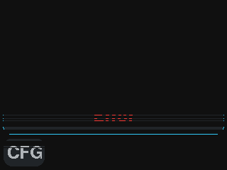

*Figura: boot_screen.bmp — capturada em HW alpha14 2026-05-08*

### 4.2 Tela Auth (PIN entrance)


*Figura: auth_screen.bmp — capturada em HW alpha14 2026-05-08*

`showAuthScreen(String expectedPin)` em DisplayManager.h:200.

### 4.3 Dashboard principal

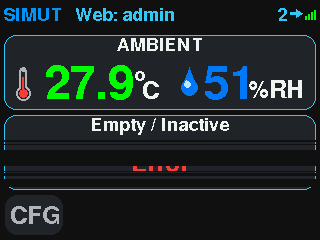

*Figura: dashboard.bmp — capturada em HW alpha14 2026-05-08*
- TopBar: hora, status WiFi, alarmes ativos
- Painel ambiente (temp + humidade SHT31)
- 10 slots de sensores DS18B20 (panéis menores)
- BottomButtons: navegação (gráfico, alarmes, settings)

`drawInterfaceFixed`, `drawTopBar`, `drawAmbientPanel`, `drawSlotPanel`, `drawBottomButtons`.

### 4.4 Tela Gráfico (histórico)

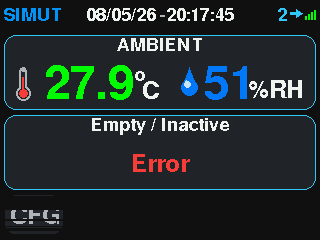

*Figura: graph.bmp — capturada em HW alpha14 2026-05-08*

`drawGraphScreen()`, `drawGraphHeaderBar()`, `drawPeakMarker()`.

Variantes:
- `drawGraphDetailScreen()` — tela numérica de detalhes do período
- `drawStatsScreen()` — estatísticas (min/max/avg)
- `drawCalendarScreen()` — calendário com dias de dados disponíveis

### Bonus: Tela Settings (capturada via touch sim)

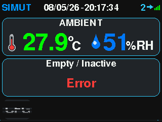

*Figura: TFT settings_main — capturada após `touch sim 50 220` em HW alpha14*

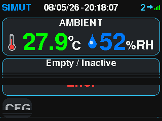

*Figura: TFT slot detail — capturada após `touch sim 80 80` em HW alpha14*

### 4.5 Telas de Configuração (Settings)

Acessível via gesto longo no dashboard. Submenus:

- `showSettingsMain()` — menu principal
- `showSettingsAlarms(cfg)` + `showAlarmEdit(idx)` — limites por slot
- `showSettingsThemes(idx)` — seletor de tema (`unimed_dark.thm` é o atual)
- `showSettingsLang(idx)` — pt-BR / en-US (default English)
- `showSettingsPassword()` — chpass admin
- `showSettingsDisplayOffset()` — calibração de canto da tela TFT
- `showSettingsSounds(state)` — buzzer config
- `showSettingsLicense()` — info de licença
- `showTouchCalibration()` / `showTouchSensitivity()` — calibrar XPT2046
- `showSystemStatus()` / `drawSystemStatus()` — info de chip, heap, uptime, etc

### 4.6 Tela de Alarmes

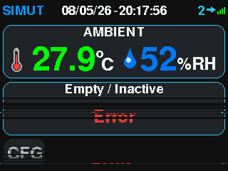

*Figura: alarm_action.bmp — capturada em HW alpha14 2026-05-08*

---

## 5. Web UI (browser)

WiFi típico: `192.168.3.195` (DHCP). Login obrigatório (sha256 client-side antes do POST).

**Captura:** Headless Chrome via Selenium. Cada página em `/data/web/*.gz` é servida via PROGMEM ou LFS.

### 5.1 `/login` (sem auth)

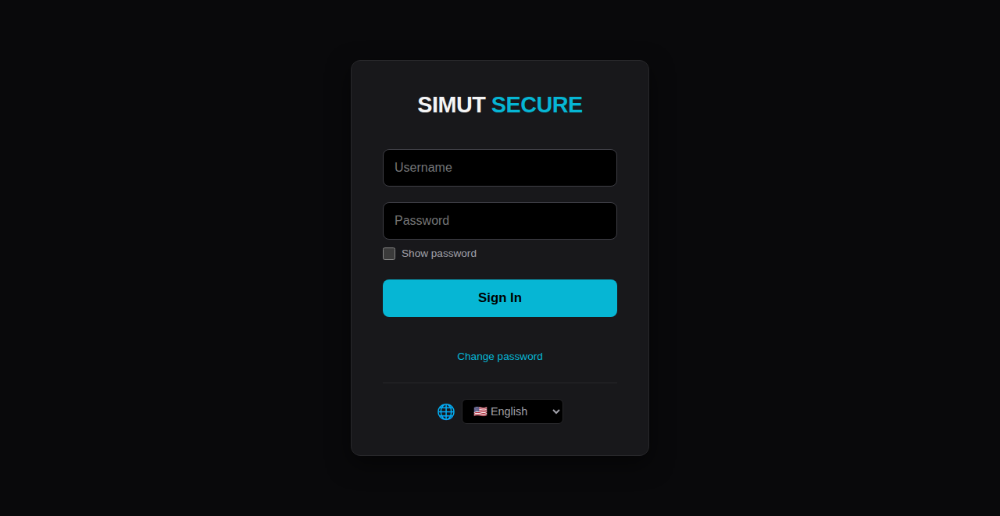

*Figura: web_login.png — capturada em HW alpha14 2026-05-08*

`handleLogin()` → POST `/api/login_init` retorna nonce; POST `/api/login` com sha256 da senha + nonce.

### 5.2 `/force_chpass` (após primeiro login com OTP)


*Figura: web_force_chpass.png — capturada em HW alpha14 2026-05-08*

### 5.3 `/` (Dashboard)

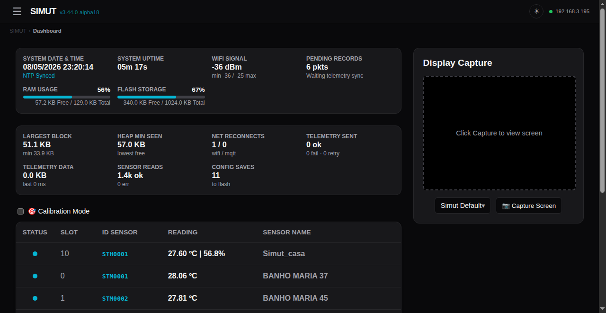

*Figura: web_dashboard.png — capturada em HW alpha14 2026-05-08*
- Painel ambiente
- 10 cards de sensores (cor por estado: ok/warn/error)
- Botão Settings/Files/History
- Tema dinâmico via `/api/themes`

### 5.4 `/history` (Histórico/Gráficos)

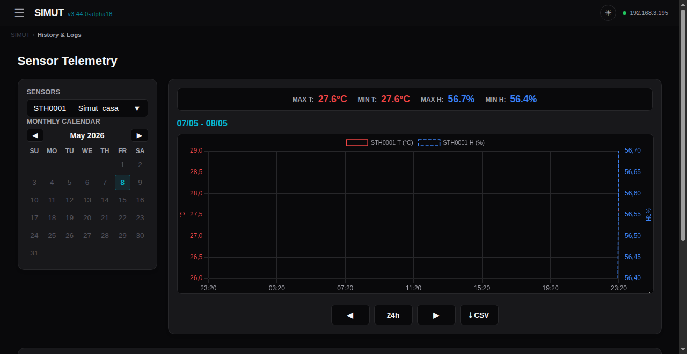

*Figura: web_history.png — capturada em HW alpha14 2026-05-08*

API: `/api/history_multi`, `/api/history_days`, `/api/export/history.bin` (CSV-equivalente).

### 5.5 `/alarms` (Configuração de Alarmes)

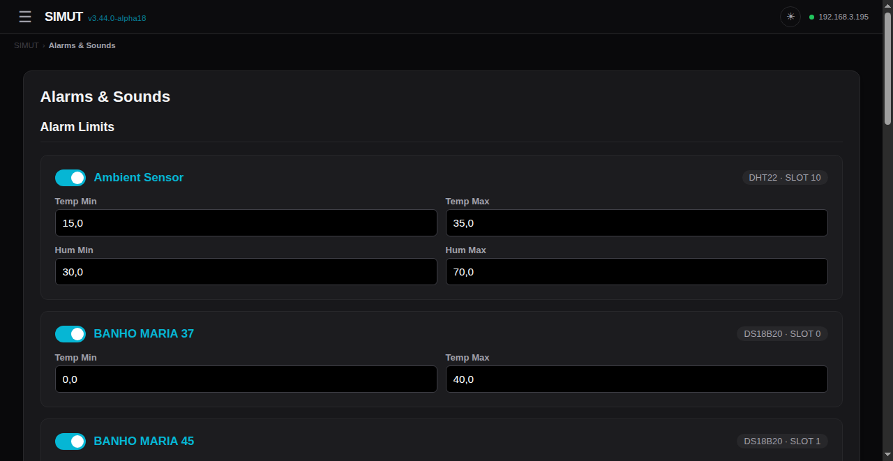

*Figura: web_alarms.png — capturada em HW alpha14 2026-05-08*

API: `/api/alarms`.

### 5.6 `/config` (Configuração geral)

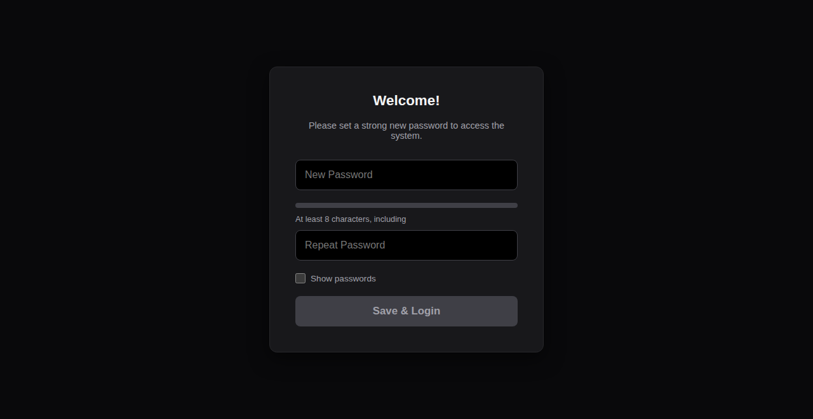

*Figura: web_config.png — capturada em HW alpha14 2026-05-08*

API: `/api/config` GET, `/api/save_sys` POST.

### 5.7 `/network` (WiFi config)

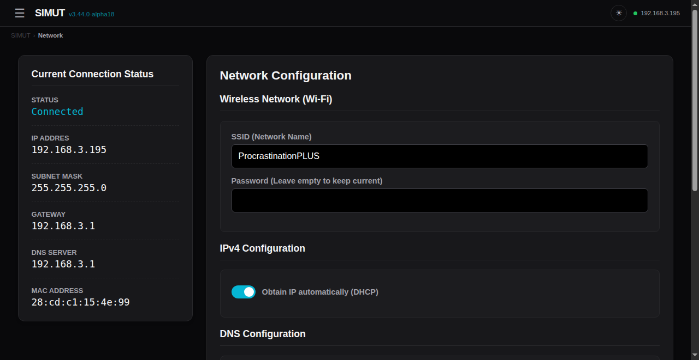

*Figura: web_network.png — capturada em HW alpha14 2026-05-08*

API: `/api/network`.

### 5.8 `/users` (Gestão de usuários)

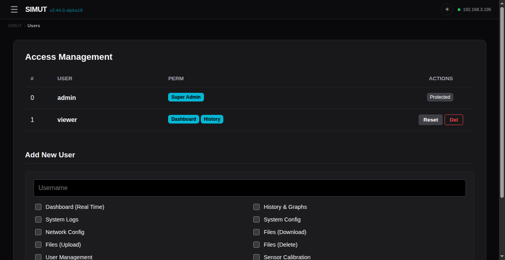

*Figura: web_users.png — capturada em HW alpha14 2026-05-08*

API: `/api/users`.

### 5.9 `/files` (File manager + OTA Firmware)

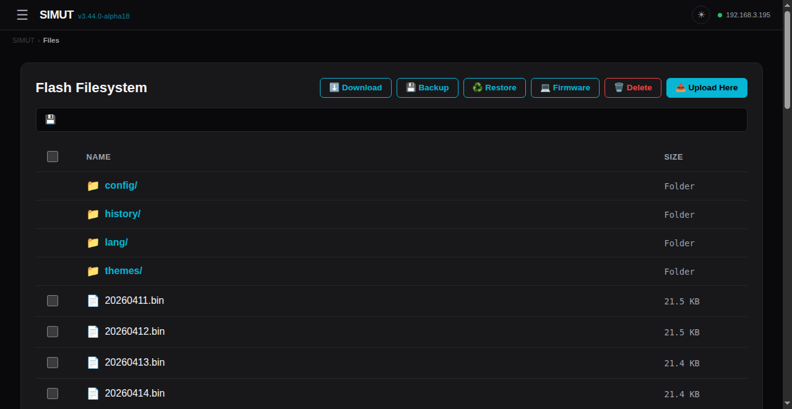

*Figura: web_files.png — capturada em HW alpha14 2026-05-08*

Botão **Backup** baixa arquivo `.bkp` da LittleFS toda (`GET /api/backup`).
Botão **Restore** valida + aplica `.bkp` (`POST /api/restore?op=validate|apply`).
Botão **Firmware** dispara OTA com WARN modal + safety checks (`POST /api/restore?op=stage&commit=1` + `POST /api/ota/apply`).

### 5.10 `/license` + `/api/sec_status`

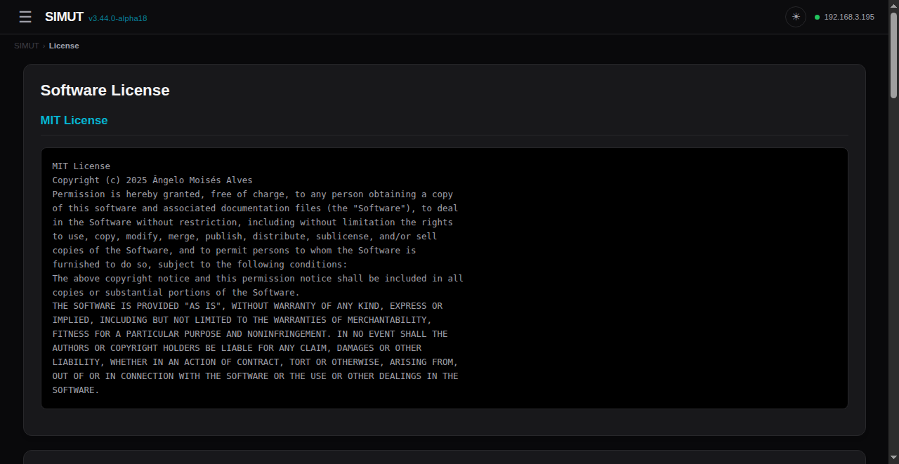

*Figura: web_license.png — capturada em HW alpha14 2026-05-08*

### 5.11 Endpoints utilitários

- `/api/status` — info runtime (heap, uptime, sensors)
- `/api/perms` — permissions do user atual
- `/api/calib` GET/POST — calibração `calib.csv` (offsets por sensor)
- `/api/themes` — lista de temas instalados em `/themes/`
- `/api/lang` — JSON de strings traduzidas
- `/api/screenshot` — **CAPTURA DA TELA TFT em BMP 320×240 24-bit**
- `/api/logs` GET / `/api/clear_logs` POST
- `/api/export/logs.bin` — eventos LogManager em formato binário

### 5.12 Endpoint OTA (firmware self-flash)

- `POST /api/restore?op=stage&commit=1` — sobe `.bin` do firmware para staging
- `POST /api/ota/apply` — gatilho do orchestrator (HTTP 202, device reboota)
- Boot pós-apply restaura snapshot `/config/system.bin` + reformata LFS

---

## 6. CLI (USB Serial — sem auth)

Conectado via `/dev/serial/by-id/usb-Raspberry_Pi_Pico_W_<chipid>-if00`. 115200 baud. Sem autenticação (acesso físico = autenticação).

### 6.1 Monitoring

```
show system info       — versão, chip, config básica
show system log        — dump de eventos do flash
show net status        — IP, RSSI, time sync
show storage stats     — uso de flash
show themes            — temas instalados
show metrics           — heap, net, tel, sensors operacionais
show sensors           — sensores mapeados (database)
sensor scan            — descoberta de novos sensores DS18B20
```

### 6.2 Configuration (precisa `write memory` + `reload` para persistir)

```
conf system name <value>           — nome do device
conf system ssid <name>            — WiFi SSID (case-sensitive)
conf system pass <pass>            — WiFi password
conf system timezone <offset>      — UTC offset (-3 = Brasília)
conf system ntp <server>           — servidor NTP
conf system theme <id|index>       — tema TFT
conf system admin reset [confirm]  — reset senha admin (OTP)
conf system touch reset [confirm]  — reset calibração touch
conf system factory [confirm]      — factory reset (apaga TUDO)
conf system history_interval <m>   — intervalo de log (1..1440 min)
conf ntp <on|off>                  — ativa/desativa NTP
conf time <YYYY-MM-DD> <HH:MM:SS>  — RTC manual
conf net dns auto                  — DNS via DHCP
conf net dns manual <ip1> [ip2]    — DNS manual
conf sensor ds18b20 resolution <9-12> — resolução DS18B20 global
```

### 6.3 Telemetry

```
conf tel server <url>      — endpoint HTTP
conf tel port <port>       — porta (80, 443)
conf tel path <path>       — endpoint path
conf tel batch <n>         — tamanho do batch
conf tel int <s>           — intervalo
```

### 6.4 Dispositivos

```
write memory               — persiste config no flash
reload [confirm]           — reboot soft (safeReboot watchdog reset)
factory [confirm]          — factory reset
language pt|en             — troca idioma display
```

### 6.5 Diagnóstico oculto

```
conf sensor <N> history all          — recupera histórico pré factory reset
conf sensor all history all          — todos os sensores (BT-only)
```

---

## 7. Procedimento OTA (firmware update)

### 7.1 Via Web UI (recomendado)

1. Login como admin com `PERM_FILE_UPLOAD`
2. Acessar `/files`, clicar **Firmware**
3. Modal exibe AVISO + verifica `.bkp` da LFS atual
4. Selecionar `.bin` (firmware RAW, sem gzip)
5. Confirmar duplo (sumário + downgrade warn)
6. Upload progress → stage → commit → apply
7. Device reboota; redireciona para `/login` em ~60s

### 7.2 Via CLI/curl (autonomia)

```bash
# 1. Login
curl -c cookie.txt -X POST -d 'user=admin&pass=<sha256>&nonce=<nonce>' \
  http://192.168.3.195/api/login

# 2. Stage + commit firmware
curl -b cookie.txt -F "firmware=@firmware.bin" \
  "http://192.168.3.195/api/restore?op=stage&commit=1"

# 3. Apply (HTTP 202; device reboota)
curl -b cookie.txt -X POST http://192.168.3.195/api/ota/apply
```

### 7.3 Wrapper Python (test_f9_snapshot.sh usa)

`tools/ota_apply.py` automatiza: backup .bkp + stage + commit + apply + wait_for_device.

---

## 8. Recovery (em caso de brick)

### 8.1 Brick "USB CDC mute" pós-OTA

Sintoma: USB enumera como `2e8a:f00a Raspberry Pi Pico W` mas serial CLI não responde, HTTP timeout.

**Recovery soft:**
1. RESET via PicoHand: `mão RESET` ou pulso RUN físico → boot fresh
2. Configurar WiFi via CLI (config foi preservada via snapshot)

**Recovery hard (se soft falhar):**
1. BOOTSEL via PicoHand: `mão BOOTSEL` ou botão físico
2. `picotool erase -a` (apaga TODO o flash, incluindo metadata partition)
3. `picotool load -x tools/test_firmwares/pico_blink_echo/build/pico_blink_echo.ino.uf2` — verifica chip OK
4. `picotool load -x .pio/build/pico_w_release/firmware.uf2` — flash SIMUT
5. Configurar WiFi novamente via CLI

### 8.2 Brick "Pico não responde nem com BOOTSEL"

Solução empírica do user (2026-05-08): **flashar firmware básico** (blink ou serial echo) "revive" o Pico. Após blink rodar, BOOTSEL volta a funcionar normalmente.

`tools/test_firmwares/pico_blink_echo/` — UF2 mínimo de revival.

---

## 9. Arquitetura LittleFS (`/data/`)

```
/data/
├── calib.csv              — sensor offsets + nomes (versionado)
├── config/
│   ├── system.bin         — config encrypted (WiFi/users/sensors/...)
│   ├── system.bak         — backup automático do system.bin
│   └── t_cursor.bin       — cursor de telemetria (último ts enviado)
├── history/
│   └── YYYYMMDD.bin       — histórico binário 1 ponto/min por sensor
├── lang/
│   ├── language_pt-BR.lng
│   └── language_es-ES.lng
├── themes/
│   └── unimed_dark.thm    — tema TFT (RGB565 pixels + meta)
├── web/                   — páginas comprimidas servidas via /
│   ├── login_page.gz
│   ├── dash_page.gz
│   ├── hist_page.gz
│   ├── cfg_page.gz
│   ├── alarms_page.gz
│   ├── net_page.gz
│   ├── usr_page.gz
│   ├── file_page.gz
│   ├── force_chpass_page.gz
│   ├── license_page.gz
│   ├── lang_js.gz
│   └── style_css.gz
├── system.blog            — log binário ativo (LogManager)
├── system.old.blog        — log rotacionado
└── favicon.ico
```

---

## 10. Geração automatizada deste manual (TODO próxima sessão)

### 10.1 Captura de tela TFT via API

```bash
# Login + obter cookie
curl -c /tmp/simut.cookie -X POST -d "user=admin&pass=$(echo -n 'senha' | sha256sum | head -c 64)&nonce=$(curl -s http://192.168.3.195/api/login_init | jq -r .nonce)" \
  http://192.168.3.195/api/login

# Capturar screenshot (BMP 320x240 24-bit)
curl -b /tmp/simut.cookie -o screenshot.bmp http://192.168.3.195/api/screenshot

# Converter para PNG
convert screenshot.bmp screenshot.png
```

**Streaming garantido:** o handler `handleApiScreenshot` em `WebManager_History.cpp:861` faz read row-by-row do framebuffer com `_displayRef->readRow()`, alimenta WDT a cada 4 rows, e detecta client disconnect. Resposta tem `Content-Length` exato — falha de pixels = bytes faltantes detectáveis.

### 10.2 Comando para simular toque (NÃO IMPLEMENTADO)

Próxima sessão: adicionar comando CLI `touch sim X Y` em `AppManager_Commands.cpp` que injeta um evento de toque simulado em `DisplayManager` via `_displayMgr->injectTouch(x, y)` (método novo que faria push em `_rawTouchState` ou similar).

Fluxo proposto:
```
SIMUT> touch sim 160 120          ← toque no centro
SIMUT> touch sim 50 220           ← toque no botão "Settings"
SIMUT> touch sim 270 220          ← toque no botão "Graph"
```

Ou via API:
```
POST /api/touch?x=160&y=120
```

### 10.3 Captura browser

```bash
# Selenium/headless Chrome
python -c "
from selenium import webdriver
from selenium.webdriver.chrome.options import Options
opts = Options()
opts.add_argument('--headless')
opts.add_argument('--window-size=1280,800')
driver = webdriver.Chrome(options=opts)

# Login
driver.get('http://192.168.3.195/login')
driver.find_element('id', 'user').send_keys('admin')
driver.find_element('id', 'pass').send_keys('senha')
driver.find_element('id', 'submit').click()

# Capture pages
for url in ['/', '/history', '/alarms', '/config', '/network', '/users', '/files']:
    driver.get('http://192.168.3.195' + url)
    driver.save_screenshot('docs/screenshots/web' + url.replace('/', '_') + '.png')
"
```

### 10.4 PDF final

```bash
# Markdown → PDF via pandoc
pandoc docs/MANUAL.md -o docs/MANUAL.pdf \
  --pdf-engine=xelatex \
  --toc \
  --highlight-style=tango \
  -V geometry:margin=2cm
```

---

## 11. Referências

- `STABILITY_PLAN.md` — plano de estabilidade canônico (consultar antes de qualquer mudança)
- `docs/INVESTIGATION_BOOTLOOP.md` — investigação F-OTA-BOOTLOOP (Achados #1-#7)
- `docs/RECOVERY.md` — procedimento BOOTSEL + 1200bps trick
- `docs/RELEASE_NOTES_v3.44.0-alpha*.md` — release notes por alpha
- `tools/PicoHand/MANUAL_CLAUDE_CODE.md` — manual da mão robótica
- GitHub: https://github.com/angeloINTJ/SIMUT/tree/feature/ota-self-flash

---

🤖 Manual gerado em 2026-05-08 com base em código-fonte v3.44.0-alpha13. Screenshots pendentes — gerar via captura programática quando device estável.
