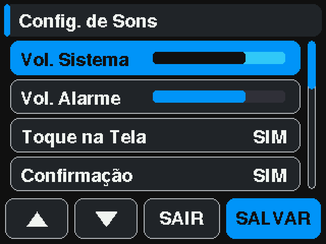
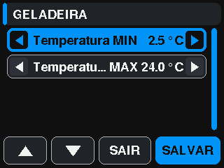
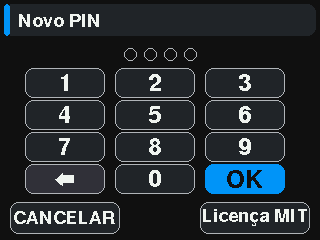

# SIMUT display screens

Generated by `tools/screen_mapper.py` against a real device. Every
frame was read back off the panel through `GET /api/screenshot`.

| Screen | UiMode | How to reach it | What it is |
|---|---|---|---|
|  `dashboard` | `MODE_DASHBOARD` | `screen dash` | Live readings, two sensor cards and the slot footer |
|  `auth-keypad` | `MODE_AUTH` | `screen dash -> tap(286,215)` | PIN entry guarding the settings menu |
|  `settings-main` | `MODE_SETTINGS_MAIN` | `screen set` | Settings menu |
|  `settings-sounds` | `MODE_SETTINGS_SOUNDS` | `screen set -> tap(105,215) -> tap(105,215) -> tap(250,215)` | Alarm sound settings, third item of the menu |
|  `settings-themes` | `MODE_SETTINGS_THEMES` | `screen thm` | Theme picker |
|  `settings-lang` | `MODE_SETTINGS_LANG` | `screen lng` | Interface language |
|  `settings-password` | `MODE_SETTINGS_PASSWORD` | `screen pwd` | On-screen keyboard for the display PIN |
|  `settings-alarms` | `MODE_SETTINGS_ALARMS` | `screen alm` | Per-sensor alarm thresholds |
|  `settings-alarm-edit` | `MODE_SETTINGS_ALARM_EDIT` | `screen alm -> tap(270,60)` | Threshold editor for one sensor |
|  `settings-status` | `MODE_SETTINGS_STATUS` | `screen sts` | Real-time system status |
|  `settings-license` | `MODE_SETTINGS_LICENSE` | `screen lic` | License text |
|  `settings-offset` | `MODE_SETTINGS_DISPLAY_OFFSET` | `screen offset` | Display position adjustment |
|  `touch-calibration` | `MODE_SETTINGS_TOUCH_CAL` | `screen touchcal` | Touch calibration crosshairs |
|  `touch-sensitivity` | `MODE_SETTINGS_TOUCH_SENS` | `screen touchsens` | Touch pressure calibration |
|  `graph` | `MODE_GRAPH_VIEW` | `screen gra` | History plot for the selected sensor |
|  `graph-detail` | `MODE_GRAPH_DETAIL` | `screen gra -> tap(160,120)` | Numeric detail: max, min, average, standard deviation |
|  `calendar` | `MODE_CALENDAR` | `screen gra -> tap(160,215)` | Month picker, third button of the graph bar |

## Identity at the panel (config v24)

Captured on the rig on 2026-09-19 by `tools/panel_users_hw_test.py`, which
drives the panel through `POST /api/touch` (see the script for why not
`touch sim`). Tags: `screen pin`, `screen usr`.

| Screen | UiMode | How to reach it | What it is |
|---|---|---|---|
|  `panel-pin-keypad` | `MODE_AUTH` | `screen dash -> tap(286,215)` | The numeric PIN keypad that replaced the device PIN; the PIN identifies the account |
|  `panel-pin-invalid` | `MODE_AUTH` | wrong PIN + OK | Refused; the lockout ladder runs behind it |
|  `panel-menu-operator` | `MODE_SETTINGS_MAIN` | PIN of an account with panel bits only | The menu lists what the account's bits reach |
|  `panel-sensor-menu` | `MODE_SETTINGS_ALARM_SENSOR` | `screen alm -> tap(160,57)` | Per-sensor actions: limits, alarms on/off, maintenance |
|  `panel-sensor-menu-maint-only` | `MODE_SETTINGS_ALARM_SENSOR` | same, account with `PERM_MAINT` only | Lines without the bit are dimmed with a padlock (kept when selected); the menu opens on the first line the account may use |
|  `panel-limit-editor` | `MODE_SETTINGS_ALARM_EDIT` | sensor menu -> Alarm limits | The limit editor; SAVE stores and sends `alarm_lim` with `lo`/`hi` |
|  `panel-maint-entry` | `MODE_SETTINGS_MAINT` | sensor menu -> Maintenance | Hours and minutes of the window |
|  `panel-maint-remaining` | `MODE_SETTINGS_MAINT` | same, window open | Time left; END closes early |
|  `panel-users-list` | `MODE_SETTINGS_USERS` | `screen usr` | Accounts, their panel bits (L B M) and whether they hold a PIN |
|  `panel-new-user-keyboard` | `MODE_SETTINGS_PASSWORD` | users -> NEW | The name of a new account |
|  `panel-new-user-bits` | `MODE_SETTINGS_USER_EDIT` | name -> OK | The three panel bits; NEXT asks for the PIN twice |
|  `panel-new-user-pin` | `MODE_AUTH` | bits -> NEXT | New PIN, typed twice |
|  `panel-pin-in-use` | `MODE_PANEL_MESSAGE` | a PIN another account holds | Core 0's verdict: refused, nothing saved |
|  `panel-delete-confirm` | `MODE_SETTINGS_USER_CONFIRM_DEL` | editor -> Delete user | Confirmation before an account goes |

## Modes this tool does not drive

- **`MODE_ALARM_ACTION`** — needs a sensor genuinely outside its thresholds
- **`MODE_CONFIRM_MUTE_ALL`** — a destructive confirmation; driving it risks silencing every alarm
- **`MODE_GRAPH_LOADING`** — transient -- only painted while a 7-day range is being read
- **`MODE_STATS_VIEW`** — no touch path reaches it -- see the note in screens.md

`settings-sounds` needs a longer settle than the default: the screenshot
endpoint answers 503 for ~5 s after a simulated tap, so the capture is taken
with a 6.5 s pause after the last navigation tap.
