# SIMUT display screens

Generated by `tools/screen_mapper.py` against a real device. Every
frame was read back off the panel through `GET /api/screenshot`.

| Screen | UiMode | How to reach it | What it is |
|---|---|---|---|
| 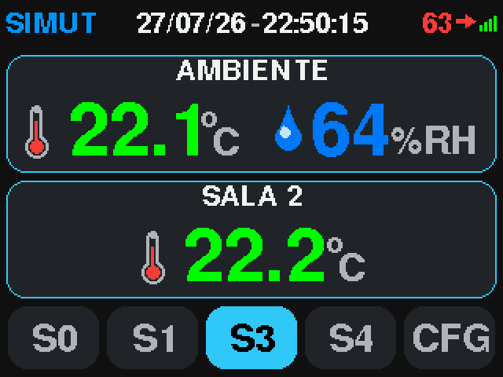 `dashboard` | `MODE_DASHBOARD` | `screen dash` | Live readings, two sensor cards and the slot footer |
| 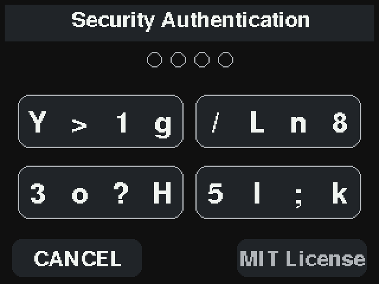 `auth-keypad` | `MODE_AUTH` | `screen dash -> tap(286,215)` | PIN entry guarding the settings menu |
| 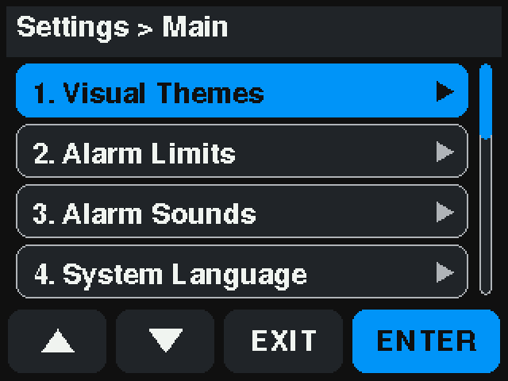 `settings-main` | `MODE_SETTINGS_MAIN` | `screen set` | Settings menu |
| — `settings-sounds` | `MODE_SETTINGS_SOUNDS` | `screen set -> tap(105,215) -> tap(105,215) -> tap(250,215)` | Alarm sound settings, third item of the menu |
| 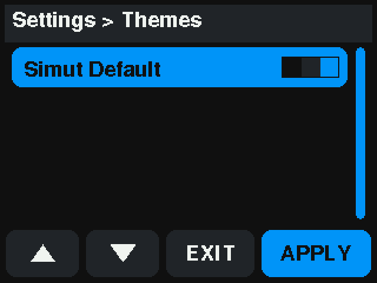 `settings-themes` | `MODE_SETTINGS_THEMES` | `screen thm` | Theme picker |
| 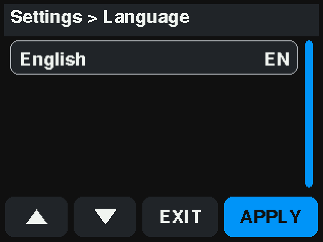 `settings-lang` | `MODE_SETTINGS_LANG` | `screen lng` | Interface language |
| 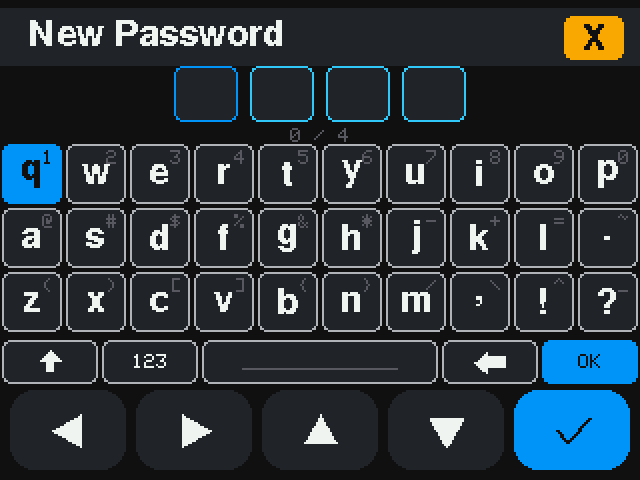 `settings-password` | `MODE_SETTINGS_PASSWORD` | `screen pwd` | On-screen keyboard for the display PIN |
| 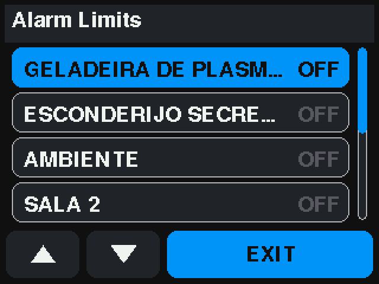 `settings-alarms` | `MODE_SETTINGS_ALARMS` | `screen alm` | Per-sensor alarm thresholds |
| 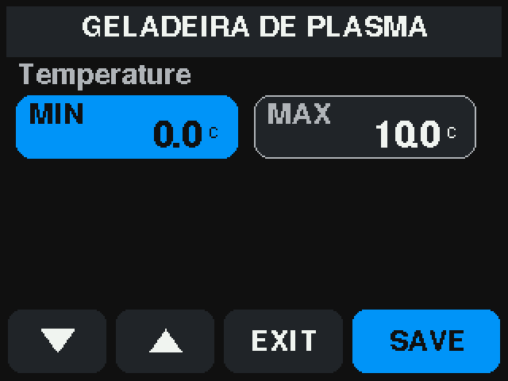 `settings-alarm-edit` | `MODE_SETTINGS_ALARM_EDIT` | `screen alm -> tap(270,60)` | Threshold editor for one sensor |
| 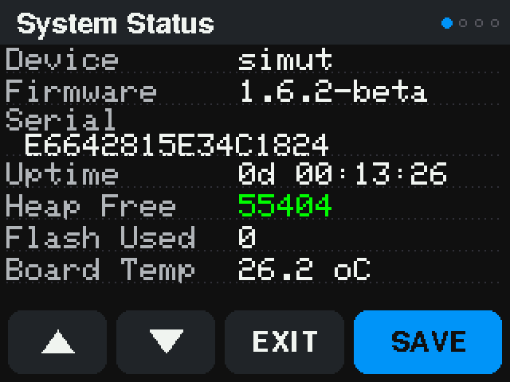 `settings-status` | `MODE_SETTINGS_STATUS` | `screen sts` | Real-time system status |
| 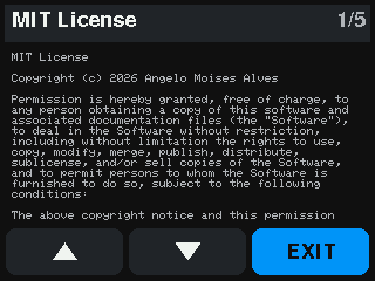 `settings-license` | `MODE_SETTINGS_LICENSE` | `screen lic` | License text |
| 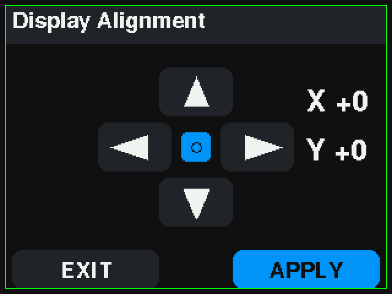 `settings-offset` | `MODE_SETTINGS_DISPLAY_OFFSET` | `screen offset` | Display position adjustment |
| 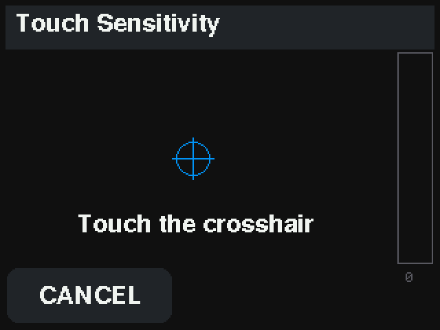 `touch-calibration` | `MODE_SETTINGS_TOUCH_CAL` | `screen touchcal` | Touch calibration crosshairs |
| 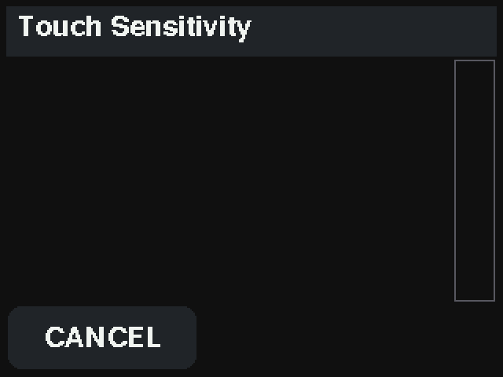 `touch-sensitivity` | `MODE_SETTINGS_TOUCH_SENS` | `screen touchsens` | Touch pressure calibration |
| 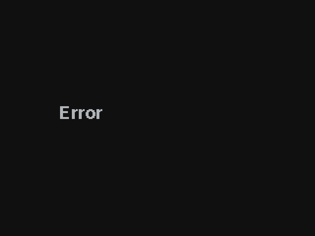 `graph` | `MODE_GRAPH_VIEW` | `screen gra` | History plot for the selected sensor |
| 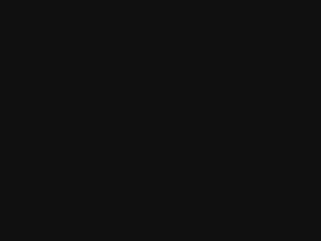 `graph-detail` | `MODE_GRAPH_DETAIL` | `screen gra -> tap(160,120)` | Numeric detail: max, min, average, standard deviation |
| 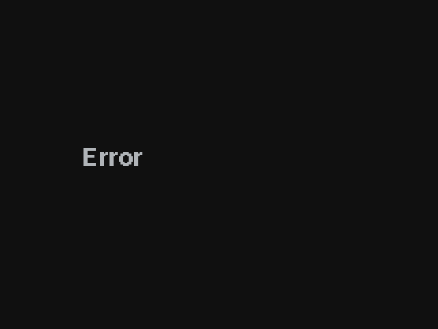 `calendar` | `MODE_CALENDAR` | `screen gra -> tap(160,215)` | Month picker, third button of the graph bar |

## Modes this tool does not drive

- **`MODE_ALARM_ACTION`** — needs a sensor genuinely outside its thresholds
- **`MODE_CONFIRM_MUTE_ALL`** — a destructive confirmation; driving it risks silencing every alarm
- **`MODE_GRAPH_LOADING`** — transient -- only painted while a 7-day range is being read
- **`MODE_STATS_VIEW`** — no touch path reaches it -- see the note in screens.md

## Did not capture

- **`settings-sounds`** via `screen set -> tap(105,215) -> tap(105,215) -> tap(250,215)`
